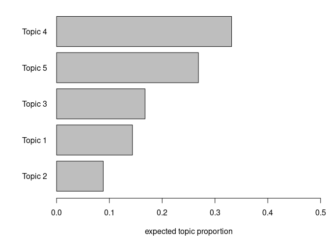
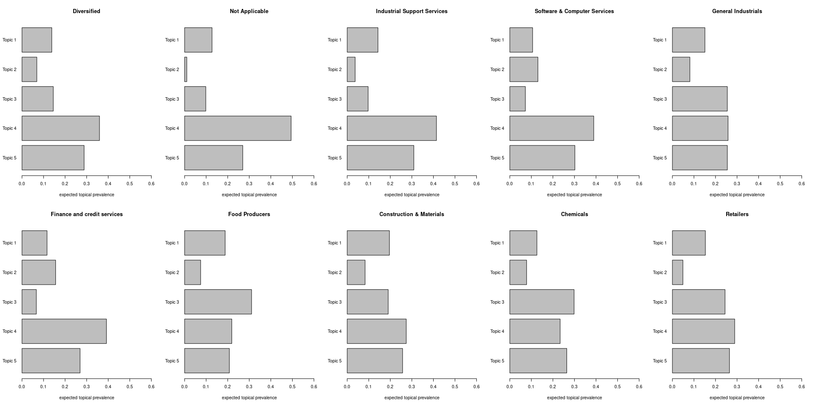

### Load data

``` r
library(arrow)
library(dplyr)

processed_data_path = "/mnt/Data/git_root/sustainability-reports-industry-analysis/data/processed.parquet"
data = arrow::read_parquet(processed_data_path)

data = data %>% 
  mutate(type = case_when(
    type == "SME" ~ "SME",
    type == "NGO Global" ~ "NGO",
    type == "NGO Local" ~ "NGO",
    type == "Company" ~ "Company",
    TRUE ~ "Other"
  )) %>% 
  filter(type != "Other")
```

### Preprocessing

``` r
library(stm)

processed = textProcessor(
  documents = data$reconstructed_text,
  metadata = data,
  lowercase = FALSE,
  removepunctuation = FALSE,
  removenumbers = FALSE,
  removestopwords = FALSE,
  stem = FALSE)
```

    ## Building corpus... 
    ## Creating Output...

``` r
out = prepDocuments(
  processed$documents,
  processed$vocab,
  processed$meta)

docs = out$documents
vocab = out$vocab
meta = out$meta
```

### STM

``` r
n=5
stm_model = stm(documents = docs, vocab = vocab,
      K = n, prevalence =~ type,
        data = meta, max.em.its = 750)
```

    ## Beginning Spectral Initialization 
    ##   Calculating the gram matrix...
    ##   Using only 10000 most frequent terms during initialization...
    ##   Finding anchor words...
    ##      .....
    ##   Recovering initialization...
    ##      ....................................................................................................
    ## Initialization complete.
    ## ....................................................................................................
    ## Completed E-Step (6 seconds). 
    ## Completed M-Step. 
    ## Completing Iteration 1 (approx. per word bound = -7.341) 
    ## ....................................................................................................
    ## Completed E-Step (3 seconds). 
    ## Completed M-Step. 
    ## Completing Iteration 2 (approx. per word bound = -7.338, relative change = 3.344e-04) 
    ## ....................................................................................................
    ## Completed E-Step (4 seconds). 
    ## Completed M-Step. 
    ## Completing Iteration 3 (approx. per word bound = -7.338, relative change = 2.506e-05) 
    ## ....................................................................................................
    ## Completed E-Step (4 seconds). 
    ## Completed M-Step. 
    ## Completing Iteration 4 (approx. per word bound = -7.338, relative change = 1.111e-05) 
    ## ....................................................................................................
    ## Completed E-Step (4 seconds). 
    ## Completed M-Step. 
    ## Completing Iteration 5 (approx. per word bound = -7.338, relative change = 1.017e-05) 
    ## Topic 1: base, operation, safety, rate, corporate 
    ##  Topic 2: work, board, product, share, change 
    ##  Topic 3: information, energy, impact, new, performance 
    ##  Topic 4: report, management, group, employee, year 
    ##  Topic 5: company, business, risk, sustainability, include 
    ## ....................................................................................................
    ## Completed E-Step (4 seconds). 
    ## Completed M-Step. 
    ## Completing Iteration 6 (approx. per word bound = -7.338, relative change = 1.340e-05) 
    ## ....................................................................................................
    ## Completed E-Step (4 seconds). 
    ## Completed M-Step. 
    ## Completing Iteration 7 (approx. per word bound = -7.338, relative change = 2.453e-05) 
    ## ....................................................................................................
    ## Completed E-Step (4 seconds). 
    ## Completed M-Step. 
    ## Completing Iteration 8 (approx. per word bound = -7.337, relative change = 5.278e-05) 
    ## ....................................................................................................
    ## Completed E-Step (4 seconds). 
    ## Completed M-Step. 
    ## Completing Iteration 9 (approx. per word bound = -7.337, relative change = 7.284e-05) 
    ## ....................................................................................................
    ## Completed E-Step (4 seconds). 
    ## Completed M-Step. 
    ## Completing Iteration 10 (approx. per word bound = -7.336, relative change = 5.464e-05) 
    ## Topic 1: base, operation, safety, rate, corporate 
    ##  Topic 2: work, board, product, share, change 
    ##  Topic 3: information, energy, impact, new, performance 
    ##  Topic 4: report, management, group, employee, year 
    ##  Topic 5: company, business, risk, sustainability, include 
    ## ....................................................................................................
    ## Completed E-Step (4 seconds). 
    ## Completed M-Step. 
    ## Completing Iteration 11 (approx. per word bound = -7.336, relative change = 3.073e-05) 
    ## ....................................................................................................
    ## Completed E-Step (4 seconds). 
    ## Completed M-Step. 
    ## Completing Iteration 12 (approx. per word bound = -7.336, relative change = 2.151e-05) 
    ## ....................................................................................................
    ## Completed E-Step (4 seconds). 
    ## Completed M-Step. 
    ## Completing Iteration 13 (approx. per word bound = -7.336, relative change = 1.915e-05) 
    ## ....................................................................................................
    ## Completed E-Step (4 seconds). 
    ## Completed M-Step. 
    ## Completing Iteration 14 (approx. per word bound = -7.336, relative change = 1.880e-05) 
    ## ....................................................................................................
    ## Completed E-Step (6 seconds). 
    ## Completed M-Step. 
    ## Completing Iteration 15 (approx. per word bound = -7.336, relative change = 1.876e-05) 
    ## Topic 1: base, operation, safety, rate, corporate 
    ##  Topic 2: work, board, product, share, change 
    ##  Topic 3: information, energy, impact, new, emission 
    ##  Topic 4: report, management, group, employee, year 
    ##  Topic 5: company, business, risk, sustainability, include 
    ## ....................................................................................................
    ## Completed E-Step (4 seconds). 
    ## Completed M-Step. 
    ## Completing Iteration 16 (approx. per word bound = -7.335, relative change = 1.891e-05) 
    ## ....................................................................................................
    ## Completed E-Step (5 seconds). 
    ## Completed M-Step. 
    ## Completing Iteration 17 (approx. per word bound = -7.335, relative change = 1.934e-05) 
    ## ....................................................................................................
    ## Completed E-Step (5 seconds). 
    ## Completed M-Step. 
    ## Completing Iteration 18 (approx. per word bound = -7.335, relative change = 1.998e-05) 
    ## ....................................................................................................
    ## Completed E-Step (5 seconds). 
    ## Completed M-Step. 
    ## Completing Iteration 19 (approx. per word bound = -7.335, relative change = 2.079e-05) 
    ## ....................................................................................................
    ## Completed E-Step (5 seconds). 
    ## Completed M-Step. 
    ## Completing Iteration 20 (approx. per word bound = -7.335, relative change = 2.178e-05) 
    ## Topic 1: base, operation, safety, rate, corporate 
    ##  Topic 2: work, board, product, share, financial 
    ##  Topic 3: information, energy, impact, new, emission 
    ##  Topic 4: report, management, group, employee, year 
    ##  Topic 5: company, business, risk, sustainability, include 
    ## ....................................................................................................
    ## Completed E-Step (5 seconds). 
    ## Completed M-Step. 
    ## Completing Iteration 21 (approx. per word bound = -7.335, relative change = 2.301e-05) 
    ## ....................................................................................................
    ## Completed E-Step (5 seconds). 
    ## Completed M-Step. 
    ## Completing Iteration 22 (approx. per word bound = -7.334, relative change = 2.452e-05) 
    ## ....................................................................................................
    ## Completed E-Step (5 seconds). 
    ## Completed M-Step. 
    ## Completing Iteration 23 (approx. per word bound = -7.334, relative change = 2.628e-05) 
    ## ....................................................................................................
    ## Completed E-Step (5 seconds). 
    ## Completed M-Step. 
    ## Completing Iteration 24 (approx. per word bound = -7.334, relative change = 2.824e-05) 
    ## ....................................................................................................
    ## Completed E-Step (6 seconds). 
    ## Completed M-Step. 
    ## Completing Iteration 25 (approx. per word bound = -7.334, relative change = 3.031e-05) 
    ## Topic 1: base, operation, safety, rate, corporate 
    ##  Topic 2: work, financial, board, product, share 
    ##  Topic 3: information, energy, impact, new, emission 
    ##  Topic 4: report, management, group, employee, year 
    ##  Topic 5: company, business, risk, sustainability, include 
    ## ....................................................................................................
    ## Completed E-Step (6 seconds). 
    ## Completed M-Step. 
    ## Completing Iteration 26 (approx. per word bound = -7.334, relative change = 3.249e-05) 
    ## ....................................................................................................
    ## Completed E-Step (6 seconds). 
    ## Completed M-Step. 
    ## Completing Iteration 27 (approx. per word bound = -7.333, relative change = 3.463e-05) 
    ## ....................................................................................................
    ## Completed E-Step (6 seconds). 
    ## Completed M-Step. 
    ## Completing Iteration 28 (approx. per word bound = -7.333, relative change = 3.668e-05) 
    ## ....................................................................................................
    ## Completed E-Step (5 seconds). 
    ## Completed M-Step. 
    ## Completing Iteration 29 (approx. per word bound = -7.333, relative change = 3.897e-05) 
    ## ....................................................................................................
    ## Completed E-Step (5 seconds). 
    ## Completed M-Step. 
    ## Completing Iteration 30 (approx. per word bound = -7.333, relative change = 4.167e-05) 
    ## Topic 1: base, operation, safety, rate, corporate 
    ##  Topic 2: financial, work, board, product, share 
    ##  Topic 3: information, energy, impact, new, emission 
    ##  Topic 4: report, management, group, employee, year 
    ##  Topic 5: company, business, risk, sustainability, include 
    ## ....................................................................................................
    ## Completed E-Step (5 seconds). 
    ## Completed M-Step. 
    ## Completing Iteration 31 (approx. per word bound = -7.332, relative change = 4.476e-05) 
    ## ....................................................................................................
    ## Completed E-Step (5 seconds). 
    ## Completed M-Step. 
    ## Completing Iteration 32 (approx. per word bound = -7.332, relative change = 4.813e-05) 
    ## ....................................................................................................
    ## Completed E-Step (5 seconds). 
    ## Completed M-Step. 
    ## Completing Iteration 33 (approx. per word bound = -7.331, relative change = 5.169e-05) 
    ## ....................................................................................................
    ## Completed E-Step (5 seconds). 
    ## Completed M-Step. 
    ## Completing Iteration 34 (approx. per word bound = -7.331, relative change = 5.540e-05) 
    ## ....................................................................................................
    ## Completed E-Step (5 seconds). 
    ## Completed M-Step. 
    ## Completing Iteration 35 (approx. per word bound = -7.331, relative change = 5.928e-05) 
    ## Topic 1: base, operation, safety, rate, corporate 
    ##  Topic 2: financial, work, board, product, share 
    ##  Topic 3: information, energy, impact, new, emission 
    ##  Topic 4: report, management, group, employee, year 
    ##  Topic 5: company, business, risk, sustainability, include 
    ## ....................................................................................................
    ## Completed E-Step (5 seconds). 
    ## Completed M-Step. 
    ## Completing Iteration 36 (approx. per word bound = -7.330, relative change = 6.345e-05) 
    ## ....................................................................................................
    ## Completed E-Step (5 seconds). 
    ## Completed M-Step. 
    ## Completing Iteration 37 (approx. per word bound = -7.330, relative change = 6.796e-05) 
    ## ....................................................................................................
    ## Completed E-Step (6 seconds). 
    ## Completed M-Step. 
    ## Completing Iteration 38 (approx. per word bound = -7.329, relative change = 7.299e-05) 
    ## ....................................................................................................
    ## Completed E-Step (6 seconds). 
    ## Completed M-Step. 
    ## Completing Iteration 39 (approx. per word bound = -7.329, relative change = 7.851e-05) 
    ## ....................................................................................................
    ## Completed E-Step (6 seconds). 
    ## Completed M-Step. 
    ## Completing Iteration 40 (approx. per word bound = -7.328, relative change = 8.450e-05) 
    ## Topic 1: base, operation, safety, rate, corporate 
    ##  Topic 2: financial, work, board, product, share 
    ##  Topic 3: energy, impact, new, information, emission 
    ##  Topic 4: report, management, group, employee, year 
    ##  Topic 5: company, business, risk, sustainability, include 
    ## ....................................................................................................
    ## Completed E-Step (6 seconds). 
    ## Completed M-Step. 
    ## Completing Iteration 41 (approx. per word bound = -7.327, relative change = 9.087e-05) 
    ## ....................................................................................................
    ## Completed E-Step (6 seconds). 
    ## Completed M-Step. 
    ## Completing Iteration 42 (approx. per word bound = -7.327, relative change = 9.750e-05) 
    ## ....................................................................................................
    ## Completed E-Step (6 seconds). 
    ## Completed M-Step. 
    ## Completing Iteration 43 (approx. per word bound = -7.326, relative change = 1.044e-04) 
    ## ....................................................................................................
    ## Completed E-Step (6 seconds). 
    ## Completed M-Step. 
    ## Completing Iteration 44 (approx. per word bound = -7.325, relative change = 1.117e-04) 
    ## ....................................................................................................
    ## Completed E-Step (6 seconds). 
    ## Completed M-Step. 
    ## Completing Iteration 45 (approx. per word bound = -7.324, relative change = 1.197e-04) 
    ## Topic 1: base, operation, safety, corporate, rate 
    ##  Topic 2: financial, board, work, product, asset 
    ##  Topic 3: energy, impact, new, emission, performance 
    ##  Topic 4: report, management, group, employee, year 
    ##  Topic 5: company, business, risk, sustainability, include 
    ## ....................................................................................................
    ## Completed E-Step (6 seconds). 
    ## Completed M-Step. 
    ## Completing Iteration 46 (approx. per word bound = -7.323, relative change = 1.289e-04) 
    ## ....................................................................................................
    ## Completed E-Step (6 seconds). 
    ## Completed M-Step. 
    ## Completing Iteration 47 (approx. per word bound = -7.322, relative change = 1.396e-04) 
    ## ....................................................................................................
    ## Completed E-Step (6 seconds). 
    ## Completed M-Step. 
    ## Completing Iteration 48 (approx. per word bound = -7.321, relative change = 1.517e-04) 
    ## ....................................................................................................
    ## Completed E-Step (6 seconds). 
    ## Completed M-Step. 
    ## Completing Iteration 49 (approx. per word bound = -7.320, relative change = 1.647e-04) 
    ## ....................................................................................................
    ## Completed E-Step (6 seconds). 
    ## Completed M-Step. 
    ## Completing Iteration 50 (approx. per word bound = -7.318, relative change = 1.789e-04) 
    ## Topic 1: base, operation, safety, corporate, market 
    ##  Topic 2: financial, board, product, asset, share 
    ##  Topic 3: energy, impact, new, emission, performance 
    ##  Topic 4: report, management, group, employee, year 
    ##  Topic 5: company, business, risk, sustainability, include 
    ## ....................................................................................................
    ## Completed E-Step (6 seconds). 
    ## Completed M-Step. 
    ## Completing Iteration 51 (approx. per word bound = -7.317, relative change = 1.950e-04) 
    ## ....................................................................................................
    ## Completed E-Step (6 seconds). 
    ## Completed M-Step. 
    ## Completing Iteration 52 (approx. per word bound = -7.316, relative change = 2.138e-04) 
    ## ....................................................................................................
    ## Completed E-Step (6 seconds). 
    ## Completed M-Step. 
    ## Completing Iteration 53 (approx. per word bound = -7.314, relative change = 2.355e-04) 
    ## ....................................................................................................
    ## Completed E-Step (6 seconds). 
    ## Completed M-Step. 
    ## Completing Iteration 54 (approx. per word bound = -7.312, relative change = 2.607e-04) 
    ## ....................................................................................................
    ## Completed E-Step (6 seconds). 
    ## Completed M-Step. 
    ## Completing Iteration 55 (approx. per word bound = -7.310, relative change = 2.907e-04) 
    ## Topic 1: operation, base, corporate, market, safety 
    ##  Topic 2: financial, board, asset, product, share 
    ##  Topic 3: energy, impact, new, emission, performance 
    ##  Topic 4: report, management, group, employee, year 
    ##  Topic 5: company, business, risk, sustainability, include 
    ## ....................................................................................................
    ## Completed E-Step (6 seconds). 
    ## Completed M-Step. 
    ## Completing Iteration 56 (approx. per word bound = -7.307, relative change = 3.244e-04) 
    ## ....................................................................................................
    ## Completed E-Step (6 seconds). 
    ## Completed M-Step. 
    ## Completing Iteration 57 (approx. per word bound = -7.305, relative change = 3.591e-04) 
    ## ....................................................................................................
    ## Completed E-Step (6 seconds). 
    ## Completed M-Step. 
    ## Completing Iteration 58 (approx. per word bound = -7.302, relative change = 3.942e-04) 
    ## ....................................................................................................
    ## Completed E-Step (6 seconds). 
    ## Completed M-Step. 
    ## Completing Iteration 59 (approx. per word bound = -7.299, relative change = 4.306e-04) 
    ## ....................................................................................................
    ## Completed E-Step (6 seconds). 
    ## Completed M-Step. 
    ## Completing Iteration 60 (approx. per word bound = -7.295, relative change = 4.670e-04) 
    ## Topic 1: operation, market, base, corporate, control 
    ##  Topic 2: financial, board, asset, share, statement 
    ##  Topic 3: energy, new, emission, impact, development 
    ##  Topic 4: report, management, group, employee, year 
    ##  Topic 5: company, business, risk, sustainability, include 
    ## ....................................................................................................
    ## Completed E-Step (6 seconds). 
    ## Completed M-Step. 
    ## Completing Iteration 61 (approx. per word bound = -7.292, relative change = 4.925e-04) 
    ## ....................................................................................................
    ## Completed E-Step (6 seconds). 
    ## Completed M-Step. 
    ## Completing Iteration 62 (approx. per word bound = -7.288, relative change = 4.927e-04) 
    ## ....................................................................................................
    ## Completed E-Step (6 seconds). 
    ## Completed M-Step. 
    ## Completing Iteration 63 (approx. per word bound = -7.285, relative change = 4.728e-04) 
    ## ....................................................................................................
    ## Completed E-Step (6 seconds). 
    ## Completed M-Step. 
    ## Completing Iteration 64 (approx. per word bound = -7.281, relative change = 4.531e-04) 
    ## ....................................................................................................
    ## Completed E-Step (6 seconds). 
    ## Completed M-Step. 
    ## Completing Iteration 65 (approx. per word bound = -7.278, relative change = 4.425e-04) 
    ## Topic 1: operation, market, corporate, base, control 
    ##  Topic 2: financial, board, asset, share, statement 
    ##  Topic 3: energy, emission, new, development, impact 
    ##  Topic 4: report, management, group, employee, year 
    ##  Topic 5: company, business, risk, sustainability, include 
    ## ....................................................................................................
    ## Completed E-Step (6 seconds). 
    ## Completed M-Step. 
    ## Completing Iteration 66 (approx. per word bound = -7.275, relative change = 4.270e-04) 
    ## ....................................................................................................
    ## Completed E-Step (6 seconds). 
    ## Completed M-Step. 
    ## Completing Iteration 67 (approx. per word bound = -7.272, relative change = 3.910e-04) 
    ## ....................................................................................................
    ## Completed E-Step (6 seconds). 
    ## Completed M-Step. 
    ## Completing Iteration 68 (approx. per word bound = -7.270, relative change = 3.410e-04) 
    ## ....................................................................................................
    ## Completed E-Step (6 seconds). 
    ## Completed M-Step. 
    ## Completing Iteration 69 (approx. per word bound = -7.268, relative change = 2.925e-04) 
    ## ....................................................................................................
    ## Completed E-Step (6 seconds). 
    ## Completed M-Step. 
    ## Completing Iteration 70 (approx. per word bound = -7.266, relative change = 2.530e-04) 
    ## Topic 1: operation, market, corporate, control, base 
    ##  Topic 2: financial, board, asset, share, statement 
    ##  Topic 3: energy, emission, development, product, impact 
    ##  Topic 4: report, management, group, employee, year 
    ##  Topic 5: company, business, risk, sustainability, include 
    ## ....................................................................................................
    ## Completed E-Step (6 seconds). 
    ## Completed M-Step. 
    ## Completing Iteration 71 (approx. per word bound = -7.264, relative change = 2.229e-04) 
    ## ....................................................................................................
    ## Completed E-Step (6 seconds). 
    ## Completed M-Step. 
    ## Completing Iteration 72 (approx. per word bound = -7.263, relative change = 1.992e-04) 
    ## ....................................................................................................
    ## Completed E-Step (6 seconds). 
    ## Completed M-Step. 
    ## Completing Iteration 73 (approx. per word bound = -7.261, relative change = 1.799e-04) 
    ## ....................................................................................................
    ## Completed E-Step (6 seconds). 
    ## Completed M-Step. 
    ## Completing Iteration 74 (approx. per word bound = -7.260, relative change = 1.634e-04) 
    ## ....................................................................................................
    ## Completed E-Step (6 seconds). 
    ## Completed M-Step. 
    ## Completing Iteration 75 (approx. per word bound = -7.259, relative change = 1.488e-04) 
    ## Topic 1: operation, corporate, market, control, total 
    ##  Topic 2: financial, board, asset, share, statement 
    ##  Topic 3: energy, emission, development, product, impact 
    ##  Topic 4: report, management, group, employee, year 
    ##  Topic 5: company, business, risk, sustainability, include 
    ## ....................................................................................................
    ## Completed E-Step (6 seconds). 
    ## Completed M-Step. 
    ## Completing Iteration 76 (approx. per word bound = -7.258, relative change = 1.364e-04) 
    ## ....................................................................................................
    ## Completed E-Step (6 seconds). 
    ## Completed M-Step. 
    ## Completing Iteration 77 (approx. per word bound = -7.257, relative change = 1.265e-04) 
    ## ....................................................................................................
    ## Completed E-Step (6 seconds). 
    ## Completed M-Step. 
    ## Completing Iteration 78 (approx. per word bound = -7.256, relative change = 1.188e-04) 
    ## ....................................................................................................
    ## Completed E-Step (6 seconds). 
    ## Completed M-Step. 
    ## Completing Iteration 79 (approx. per word bound = -7.256, relative change = 1.131e-04) 
    ## ....................................................................................................
    ## Completed E-Step (6 seconds). 
    ## Completed M-Step. 
    ## Completing Iteration 80 (approx. per word bound = -7.255, relative change = 1.094e-04) 
    ## Topic 1: operation, corporate, total, control, market 
    ##  Topic 2: financial, asset, share, statement, board 
    ##  Topic 3: energy, emission, product, development, impact 
    ##  Topic 4: report, management, group, employee, year 
    ##  Topic 5: company, business, risk, sustainability, include 
    ## ....................................................................................................
    ## Completed E-Step (6 seconds). 
    ## Completed M-Step. 
    ## Completing Iteration 81 (approx. per word bound = -7.254, relative change = 1.078e-04) 
    ## ....................................................................................................
    ## Completed E-Step (6 seconds). 
    ## Completed M-Step. 
    ## Completing Iteration 82 (approx. per word bound = -7.253, relative change = 1.075e-04) 
    ## ....................................................................................................
    ## Completed E-Step (6 seconds). 
    ## Completed M-Step. 
    ## Completing Iteration 83 (approx. per word bound = -7.252, relative change = 1.073e-04) 
    ## ....................................................................................................
    ## Completed E-Step (6 seconds). 
    ## Completed M-Step. 
    ## Completing Iteration 84 (approx. per word bound = -7.252, relative change = 1.056e-04) 
    ## ....................................................................................................
    ## Completed E-Step (6 seconds). 
    ## Completed M-Step. 
    ## Completing Iteration 85 (approx. per word bound = -7.251, relative change = 1.020e-04) 
    ## Topic 1: operation, total, corporate, control, risk 
    ##  Topic 2: financial, asset, statement, share, board 
    ##  Topic 3: energy, emission, product, development, impact 
    ##  Topic 4: report, management, employee, group, service 
    ##  Topic 5: business, company, sustainability, include, risk 
    ## ....................................................................................................
    ## Completed E-Step (6 seconds). 
    ## Completed M-Step. 
    ## Completing Iteration 86 (approx. per word bound = -7.250, relative change = 9.727e-05) 
    ## ....................................................................................................
    ## Completed E-Step (6 seconds). 
    ## Completed M-Step. 
    ## Completing Iteration 87 (approx. per word bound = -7.250, relative change = 9.189e-05) 
    ## ....................................................................................................
    ## Completed E-Step (5 seconds). 
    ## Completed M-Step. 
    ## Completing Iteration 88 (approx. per word bound = -7.249, relative change = 8.639e-05) 
    ## ....................................................................................................
    ## Completed E-Step (5 seconds). 
    ## Completed M-Step. 
    ## Completing Iteration 89 (approx. per word bound = -7.248, relative change = 8.134e-05) 
    ## ....................................................................................................
    ## Completed E-Step (5 seconds). 
    ## Completed M-Step. 
    ## Completing Iteration 90 (approx. per word bound = -7.248, relative change = 7.731e-05) 
    ## Topic 1: corporate, operation, total, control, risk 
    ##  Topic 2: financial, asset, statement, share, board 
    ##  Topic 3: energy, emission, product, development, impact 
    ##  Topic 4: report, management, employee, group, service 
    ##  Topic 5: business, company, sustainability, include, risk 
    ## ....................................................................................................
    ## Completed E-Step (5 seconds). 
    ## Completed M-Step. 
    ## Completing Iteration 91 (approx. per word bound = -7.247, relative change = 7.458e-05) 
    ## ....................................................................................................
    ## Completed E-Step (5 seconds). 
    ## Completed M-Step. 
    ## Completing Iteration 92 (approx. per word bound = -7.247, relative change = 7.319e-05) 
    ## ....................................................................................................
    ## Completed E-Step (5 seconds). 
    ## Completed M-Step. 
    ## Completing Iteration 93 (approx. per word bound = -7.246, relative change = 7.317e-05) 
    ## ....................................................................................................
    ## Completed E-Step (5 seconds). 
    ## Completed M-Step. 
    ## Completing Iteration 94 (approx. per word bound = -7.246, relative change = 7.443e-05) 
    ## ....................................................................................................
    ## Completed E-Step (5 seconds). 
    ## Completed M-Step. 
    ## Completing Iteration 95 (approx. per word bound = -7.245, relative change = 7.678e-05) 
    ## Topic 1: corporate, operation, total, control, risk 
    ##  Topic 2: financial, asset, statement, group, share 
    ##  Topic 3: energy, emission, product, development, impact 
    ##  Topic 4: report, management, employee, group, service 
    ##  Topic 5: business, company, sustainability, include, risk 
    ## ....................................................................................................
    ## Completed E-Step (5 seconds). 
    ## Completed M-Step. 
    ## Completing Iteration 96 (approx. per word bound = -7.244, relative change = 7.974e-05) 
    ## ....................................................................................................
    ## Completed E-Step (5 seconds). 
    ## Completed M-Step. 
    ## Completing Iteration 97 (approx. per word bound = -7.244, relative change = 8.252e-05) 
    ## ....................................................................................................
    ## Completed E-Step (5 seconds). 
    ## Completed M-Step. 
    ## Completing Iteration 98 (approx. per word bound = -7.243, relative change = 8.436e-05) 
    ## ....................................................................................................
    ## Completed E-Step (5 seconds). 
    ## Completed M-Step. 
    ## Completing Iteration 99 (approx. per word bound = -7.243, relative change = 8.472e-05) 
    ## ....................................................................................................
    ## Completed E-Step (5 seconds). 
    ## Completed M-Step. 
    ## Completing Iteration 100 (approx. per word bound = -7.242, relative change = 8.248e-05) 
    ## Topic 1: corporate, operation, total, tion, area 
    ##  Topic 2: financial, asset, group, statement, share 
    ##  Topic 3: energy, emission, product, development, impact 
    ##  Topic 4: report, management, employee, group, service 
    ##  Topic 5: business, company, sustainability, include, risk 
    ## ....................................................................................................
    ## Completed E-Step (5 seconds). 
    ## Completed M-Step. 
    ## Completing Iteration 101 (approx. per word bound = -7.241, relative change = 7.709e-05) 
    ## ....................................................................................................
    ## Completed E-Step (5 seconds). 
    ## Completed M-Step. 
    ## Completing Iteration 102 (approx. per word bound = -7.241, relative change = 7.036e-05) 
    ## ....................................................................................................
    ## Completed E-Step (5 seconds). 
    ## Completed M-Step. 
    ## Completing Iteration 103 (approx. per word bound = -7.241, relative change = 6.412e-05) 
    ## ....................................................................................................
    ## Completed E-Step (5 seconds). 
    ## Completed M-Step. 
    ## Completing Iteration 104 (approx. per word bound = -7.240, relative change = 5.873e-05) 
    ## ....................................................................................................
    ## Completed E-Step (5 seconds). 
    ## Completed M-Step. 
    ## Completing Iteration 105 (approx. per word bound = -7.240, relative change = 5.379e-05) 
    ## Topic 1: tion, operation, ment, corporate, total 
    ##  Topic 2: financial, asset, group, statement, share 
    ##  Topic 3: energy, product, emission, development, impact 
    ##  Topic 4: management, report, employee, group, service 
    ##  Topic 5: business, company, sustainability, include, risk 
    ## ....................................................................................................
    ## Completed E-Step (5 seconds). 
    ## Completed M-Step. 
    ## Completing Iteration 106 (approx. per word bound = -7.239, relative change = 4.941e-05) 
    ## ....................................................................................................
    ## Completed E-Step (5 seconds). 
    ## Completed M-Step. 
    ## Completing Iteration 107 (approx. per word bound = -7.239, relative change = 4.525e-05) 
    ## ....................................................................................................
    ## Completed E-Step (5 seconds). 
    ## Completed M-Step. 
    ## Completing Iteration 108 (approx. per word bound = -7.239, relative change = 4.159e-05) 
    ## ....................................................................................................
    ## Completed E-Step (4 seconds). 
    ## Completed M-Step. 
    ## Completing Iteration 109 (approx. per word bound = -7.238, relative change = 3.875e-05) 
    ## ....................................................................................................
    ## Completed E-Step (4 seconds). 
    ## Completed M-Step. 
    ## Completing Iteration 110 (approx. per word bound = -7.238, relative change = 3.669e-05) 
    ## Topic 1: tion, ment, operation, ing, total 
    ##  Topic 2: financial, asset, group, statement, share 
    ##  Topic 3: energy, product, emission, development, impact 
    ##  Topic 4: management, report, employee, group, service 
    ##  Topic 5: business, company, sustainability, risk, include 
    ## ....................................................................................................
    ## Completed E-Step (4 seconds). 
    ## Completed M-Step. 
    ## Completing Iteration 111 (approx. per word bound = -7.238, relative change = 3.531e-05) 
    ## ....................................................................................................
    ## Completed E-Step (4 seconds). 
    ## Completed M-Step. 
    ## Completing Iteration 112 (approx. per word bound = -7.238, relative change = 3.443e-05) 
    ## ....................................................................................................
    ## Completed E-Step (4 seconds). 
    ## Completed M-Step. 
    ## Completing Iteration 113 (approx. per word bound = -7.237, relative change = 3.368e-05) 
    ## ....................................................................................................
    ## Completed E-Step (4 seconds). 
    ## Completed M-Step. 
    ## Completing Iteration 114 (approx. per word bound = -7.237, relative change = 3.282e-05) 
    ## ....................................................................................................
    ## Completed E-Step (4 seconds). 
    ## Completed M-Step. 
    ## Completing Iteration 115 (approx. per word bound = -7.237, relative change = 3.170e-05) 
    ## Topic 1: tion, ment, ing, total, gri 
    ##  Topic 2: financial, asset, group, statement, share 
    ##  Topic 3: energy, product, emission, development, impact 
    ##  Topic 4: management, report, employee, group, service 
    ##  Topic 5: business, company, sustainability, risk, include 
    ## ....................................................................................................
    ## Completed E-Step (4 seconds). 
    ## Completed M-Step. 
    ## Completing Iteration 116 (approx. per word bound = -7.237, relative change = 3.056e-05) 
    ## ....................................................................................................
    ## Completed E-Step (4 seconds). 
    ## Completed M-Step. 
    ## Completing Iteration 117 (approx. per word bound = -7.237, relative change = 2.967e-05) 
    ## ....................................................................................................
    ## Completed E-Step (4 seconds). 
    ## Completed M-Step. 
    ## Completing Iteration 118 (approx. per word bound = -7.236, relative change = 2.872e-05) 
    ## ....................................................................................................
    ## Completed E-Step (4 seconds). 
    ## Completed M-Step. 
    ## Completing Iteration 119 (approx. per word bound = -7.236, relative change = 2.738e-05) 
    ## ....................................................................................................
    ## Completed E-Step (4 seconds). 
    ## Completed M-Step. 
    ## Completing Iteration 120 (approx. per word bound = -7.236, relative change = 2.613e-05) 
    ## Topic 1: tion, ment, ing, gri, total 
    ##  Topic 2: financial, asset, group, statement, risk 
    ##  Topic 3: product, energy, development, emission, safety 
    ##  Topic 4: management, report, employee, group, provide 
    ##  Topic 5: business, company, sustainability, risk, include 
    ## ....................................................................................................
    ## Completed E-Step (4 seconds). 
    ## Completed M-Step. 
    ## Completing Iteration 121 (approx. per word bound = -7.236, relative change = 2.518e-05) 
    ## ....................................................................................................
    ## Completed E-Step (4 seconds). 
    ## Completed M-Step. 
    ## Completing Iteration 122 (approx. per word bound = -7.236, relative change = 2.441e-05) 
    ## ....................................................................................................
    ## Completed E-Step (4 seconds). 
    ## Completed M-Step. 
    ## Completing Iteration 123 (approx. per word bound = -7.235, relative change = 2.370e-05) 
    ## ....................................................................................................
    ## Completed E-Step (4 seconds). 
    ## Completed M-Step. 
    ## Completing Iteration 124 (approx. per word bound = -7.235, relative change = 2.302e-05) 
    ## ....................................................................................................
    ## Completed E-Step (4 seconds). 
    ## Completed M-Step. 
    ## Completing Iteration 125 (approx. per word bound = -7.235, relative change = 2.228e-05) 
    ## Topic 1: tion, ment, ing, gri, total 
    ##  Topic 2: financial, asset, group, statement, risk 
    ##  Topic 3: product, energy, development, safety, emission 
    ##  Topic 4: management, report, employee, group, provide 
    ##  Topic 5: business, company, sustainability, risk, include 
    ## ....................................................................................................
    ## Completed E-Step (4 seconds). 
    ## Completed M-Step. 
    ## Completing Iteration 126 (approx. per word bound = -7.235, relative change = 2.146e-05) 
    ## ....................................................................................................
    ## Completed E-Step (4 seconds). 
    ## Completed M-Step. 
    ## Completing Iteration 127 (approx. per word bound = -7.235, relative change = 2.069e-05) 
    ## ....................................................................................................
    ## Completed E-Step (4 seconds). 
    ## Completed M-Step. 
    ## Completing Iteration 128 (approx. per word bound = -7.235, relative change = 2.007e-05) 
    ## ....................................................................................................
    ## Completed E-Step (4 seconds). 
    ## Completed M-Step. 
    ## Completing Iteration 129 (approx. per word bound = -7.234, relative change = 1.950e-05) 
    ## ....................................................................................................
    ## Completed E-Step (4 seconds). 
    ## Completed M-Step. 
    ## Completing Iteration 130 (approx. per word bound = -7.234, relative change = 1.898e-05) 
    ## Topic 1: tion, ment, ing, gri, total 
    ##  Topic 2: financial, asset, group, statement, risk 
    ##  Topic 3: product, energy, development, safety, impact 
    ##  Topic 4: management, report, employee, group, provide 
    ##  Topic 5: business, company, sustainability, risk, include 
    ## ....................................................................................................
    ## Completed E-Step (4 seconds). 
    ## Completed M-Step. 
    ## Completing Iteration 131 (approx. per word bound = -7.234, relative change = 1.851e-05) 
    ## ....................................................................................................
    ## Completed E-Step (4 seconds). 
    ## Completed M-Step. 
    ## Completing Iteration 132 (approx. per word bound = -7.234, relative change = 1.807e-05) 
    ## ....................................................................................................
    ## Completed E-Step (4 seconds). 
    ## Completed M-Step. 
    ## Completing Iteration 133 (approx. per word bound = -7.234, relative change = 1.771e-05) 
    ## ....................................................................................................
    ## Completed E-Step (4 seconds). 
    ## Completed M-Step. 
    ## Completing Iteration 134 (approx. per word bound = -7.234, relative change = 1.745e-05) 
    ## ....................................................................................................
    ## Completed E-Step (4 seconds). 
    ## Completed M-Step. 
    ## Completing Iteration 135 (approx. per word bound = -7.234, relative change = 1.729e-05) 
    ## Topic 1: tion, ment, ing, total, gri 
    ##  Topic 2: financial, asset, group, statement, year 
    ##  Topic 3: product, energy, development, safety, impact 
    ##  Topic 4: management, report, employee, group, provide 
    ##  Topic 5: business, company, sustainability, risk, include 
    ## ....................................................................................................
    ## Completed E-Step (4 seconds). 
    ## Completed M-Step. 
    ## Completing Iteration 136 (approx. per word bound = -7.234, relative change = 1.716e-05) 
    ## ....................................................................................................
    ## Completed E-Step (4 seconds). 
    ## Completed M-Step. 
    ## Completing Iteration 137 (approx. per word bound = -7.233, relative change = 1.695e-05) 
    ## ....................................................................................................
    ## Completed E-Step (4 seconds). 
    ## Completed M-Step. 
    ## Completing Iteration 138 (approx. per word bound = -7.233, relative change = 1.675e-05) 
    ## ....................................................................................................
    ## Completed E-Step (4 seconds). 
    ## Completed M-Step. 
    ## Completing Iteration 139 (approx. per word bound = -7.233, relative change = 1.667e-05) 
    ## ....................................................................................................
    ## Completed E-Step (4 seconds). 
    ## Completed M-Step. 
    ## Completing Iteration 140 (approx. per word bound = -7.233, relative change = 1.659e-05) 
    ## Topic 1: tion, ment, total, ing, gri 
    ##  Topic 2: financial, asset, group, statement, year 
    ##  Topic 3: product, energy, development, safety, impact 
    ##  Topic 4: management, report, employee, group, provide 
    ##  Topic 5: business, company, sustainability, risk, include 
    ## ....................................................................................................
    ## Completed E-Step (4 seconds). 
    ## Completed M-Step. 
    ## Completing Iteration 141 (approx. per word bound = -7.233, relative change = 1.655e-05) 
    ## ....................................................................................................
    ## Completed E-Step (4 seconds). 
    ## Completed M-Step. 
    ## Completing Iteration 142 (approx. per word bound = -7.233, relative change = 1.658e-05) 
    ## ....................................................................................................
    ## Completed E-Step (4 seconds). 
    ## Completed M-Step. 
    ## Completing Iteration 143 (approx. per word bound = -7.233, relative change = 1.664e-05) 
    ## ....................................................................................................
    ## Completed E-Step (4 seconds). 
    ## Completed M-Step. 
    ## Completing Iteration 144 (approx. per word bound = -7.233, relative change = 1.683e-05) 
    ## ....................................................................................................
    ## Completed E-Step (4 seconds). 
    ## Completed M-Step. 
    ## Completing Iteration 145 (approx. per word bound = -7.232, relative change = 1.707e-05) 
    ## Topic 1: tion, ment, total, project, gri 
    ##  Topic 2: financial, asset, group, statement, year 
    ##  Topic 3: product, energy, development, safety, impact 
    ##  Topic 4: management, report, employee, group, provide 
    ##  Topic 5: business, company, sustainability, risk, include 
    ## ....................................................................................................
    ## Completed E-Step (4 seconds). 
    ## Completed M-Step. 
    ## Completing Iteration 146 (approx. per word bound = -7.232, relative change = 1.724e-05) 
    ## ....................................................................................................
    ## Completed E-Step (4 seconds). 
    ## Completed M-Step. 
    ## Completing Iteration 147 (approx. per word bound = -7.232, relative change = 1.743e-05) 
    ## ....................................................................................................
    ## Completed E-Step (4 seconds). 
    ## Completed M-Step. 
    ## Completing Iteration 148 (approx. per word bound = -7.232, relative change = 1.780e-05) 
    ## ....................................................................................................
    ## Completed E-Step (4 seconds). 
    ## Completed M-Step. 
    ## Completing Iteration 149 (approx. per word bound = -7.232, relative change = 1.811e-05) 
    ## ....................................................................................................
    ## Completed E-Step (4 seconds). 
    ## Completed M-Step. 
    ## Completing Iteration 150 (approx. per word bound = -7.232, relative change = 1.840e-05) 
    ## Topic 1: tion, ment, project, total, gri 
    ##  Topic 2: financial, asset, group, statement, year 
    ##  Topic 3: product, energy, development, safety, impact 
    ##  Topic 4: management, report, employee, group, provide 
    ##  Topic 5: business, company, sustainability, risk, include 
    ## ....................................................................................................
    ## Completed E-Step (4 seconds). 
    ## Completed M-Step. 
    ## Completing Iteration 151 (approx. per word bound = -7.232, relative change = 1.855e-05) 
    ## ....................................................................................................
    ## Completed E-Step (4 seconds). 
    ## Completed M-Step. 
    ## Completing Iteration 152 (approx. per word bound = -7.232, relative change = 1.893e-05) 
    ## ....................................................................................................
    ## Completed E-Step (4 seconds). 
    ## Completed M-Step. 
    ## Completing Iteration 153 (approx. per word bound = -7.231, relative change = 1.928e-05) 
    ## ....................................................................................................
    ## Completed E-Step (4 seconds). 
    ## Completed M-Step. 
    ## Completing Iteration 154 (approx. per word bound = -7.231, relative change = 1.962e-05) 
    ## ....................................................................................................
    ## Completed E-Step (4 seconds). 
    ## Completed M-Step. 
    ## Completing Iteration 155 (approx. per word bound = -7.231, relative change = 2.010e-05) 
    ## Topic 1: tion, project, ment, total, gri 
    ##  Topic 2: financial, group, asset, statement, year 
    ##  Topic 3: product, energy, development, safety, impact 
    ##  Topic 4: management, report, employee, group, provide 
    ##  Topic 5: business, sustainability, company, risk, include 
    ## ....................................................................................................
    ## Completed E-Step (4 seconds). 
    ## Completed M-Step. 
    ## Completing Iteration 156 (approx. per word bound = -7.231, relative change = 2.028e-05) 
    ## ....................................................................................................
    ## Completed E-Step (4 seconds). 
    ## Completed M-Step. 
    ## Completing Iteration 157 (approx. per word bound = -7.231, relative change = 2.043e-05) 
    ## ....................................................................................................
    ## Completed E-Step (5 seconds). 
    ## Completed M-Step. 
    ## Completing Iteration 158 (approx. per word bound = -7.231, relative change = 2.066e-05) 
    ## ....................................................................................................
    ## Completed E-Step (4 seconds). 
    ## Completed M-Step. 
    ## Completing Iteration 159 (approx. per word bound = -7.231, relative change = 2.092e-05) 
    ## ....................................................................................................
    ## Completed E-Step (4 seconds). 
    ## Completed M-Step. 
    ## Completing Iteration 160 (approx. per word bound = -7.230, relative change = 2.128e-05) 
    ## Topic 1: project, tion, ment, total, gri 
    ##  Topic 2: financial, group, asset, year, statement 
    ##  Topic 3: product, energy, development, safety, impact 
    ##  Topic 4: management, report, employee, group, provide 
    ##  Topic 5: business, sustainability, company, risk, include 
    ## ....................................................................................................
    ## Completed E-Step (5 seconds). 
    ## Completed M-Step. 
    ## Completing Iteration 161 (approx. per word bound = -7.230, relative change = 2.174e-05) 
    ## ....................................................................................................
    ## Completed E-Step (4 seconds). 
    ## Completed M-Step. 
    ## Completing Iteration 162 (approx. per word bound = -7.230, relative change = 2.220e-05) 
    ## ....................................................................................................
    ## Completed E-Step (4 seconds). 
    ## Completed M-Step. 
    ## Completing Iteration 163 (approx. per word bound = -7.230, relative change = 2.250e-05) 
    ## ....................................................................................................
    ## Completed E-Step (5 seconds). 
    ## Completed M-Step. 
    ## Completing Iteration 164 (approx. per word bound = -7.230, relative change = 2.264e-05) 
    ## ....................................................................................................
    ## Completed E-Step (5 seconds). 
    ## Completed M-Step. 
    ## Completing Iteration 165 (approx. per word bound = -7.230, relative change = 2.274e-05) 
    ## Topic 1: company, project, tion, total, ment 
    ##  Topic 2: financial, group, asset, year, statement 
    ##  Topic 3: product, energy, development, safety, water 
    ##  Topic 4: management, report, employee, group, provide 
    ##  Topic 5: business, sustainability, company, risk, include 
    ## ....................................................................................................
    ## Completed E-Step (5 seconds). 
    ## Completed M-Step. 
    ## Completing Iteration 166 (approx. per word bound = -7.229, relative change = 2.286e-05) 
    ## ....................................................................................................
    ## Completed E-Step (5 seconds). 
    ## Completed M-Step. 
    ## Completing Iteration 167 (approx. per word bound = -7.229, relative change = 2.302e-05) 
    ## ....................................................................................................
    ## Completed E-Step (5 seconds). 
    ## Completed M-Step. 
    ## Completing Iteration 168 (approx. per word bound = -7.229, relative change = 2.325e-05) 
    ## ....................................................................................................
    ## Completed E-Step (6 seconds). 
    ## Completed M-Step. 
    ## Completing Iteration 169 (approx. per word bound = -7.229, relative change = 2.347e-05) 
    ## ....................................................................................................
    ## Completed E-Step (5 seconds). 
    ## Completed M-Step. 
    ## Completing Iteration 170 (approx. per word bound = -7.229, relative change = 2.375e-05) 
    ## Topic 1: company, project, total, tion, gri 
    ##  Topic 2: financial, group, asset, year, statement 
    ##  Topic 3: product, energy, development, safety, water 
    ##  Topic 4: management, report, employee, group, provide 
    ##  Topic 5: business, sustainability, company, risk, include 
    ## ....................................................................................................
    ## Completed E-Step (6 seconds). 
    ## Completed M-Step. 
    ## Completing Iteration 171 (approx. per word bound = -7.229, relative change = 2.397e-05) 
    ## ....................................................................................................
    ## Completed E-Step (7 seconds). 
    ## Completed M-Step. 
    ## Completing Iteration 172 (approx. per word bound = -7.228, relative change = 2.412e-05) 
    ## ....................................................................................................
    ## Completed E-Step (5 seconds). 
    ## Completed M-Step. 
    ## Completing Iteration 173 (approx. per word bound = -7.228, relative change = 2.423e-05) 
    ## ....................................................................................................
    ## Completed E-Step (5 seconds). 
    ## Completed M-Step. 
    ## Completing Iteration 174 (approx. per word bound = -7.228, relative change = 2.430e-05) 
    ## ....................................................................................................
    ## Completed E-Step (5 seconds). 
    ## Completed M-Step. 
    ## Completing Iteration 175 (approx. per word bound = -7.228, relative change = 2.431e-05) 
    ## Topic 1: company, project, total, gri, area 
    ##  Topic 2: financial, group, asset, year, statement 
    ##  Topic 3: product, energy, development, safety, water 
    ##  Topic 4: management, report, employee, group, provide 
    ##  Topic 5: business, sustainability, company, risk, include 
    ## ....................................................................................................
    ## Completed E-Step (5 seconds). 
    ## Completed M-Step. 
    ## Completing Iteration 176 (approx. per word bound = -7.228, relative change = 2.433e-05) 
    ## ....................................................................................................
    ## Completed E-Step (5 seconds). 
    ## Completed M-Step. 
    ## Completing Iteration 177 (approx. per word bound = -7.228, relative change = 2.430e-05) 
    ## ....................................................................................................
    ## Completed E-Step (5 seconds). 
    ## Completed M-Step. 
    ## Completing Iteration 178 (approx. per word bound = -7.227, relative change = 2.427e-05) 
    ## ....................................................................................................
    ## Completed E-Step (5 seconds). 
    ## Completed M-Step. 
    ## Completing Iteration 179 (approx. per word bound = -7.227, relative change = 2.425e-05) 
    ## ....................................................................................................
    ## Completed E-Step (5 seconds). 
    ## Completed M-Step. 
    ## Completing Iteration 180 (approx. per word bound = -7.227, relative change = 2.420e-05) 
    ## Topic 1: company, project, total, gri, area 
    ##  Topic 2: financial, group, asset, year, statement 
    ##  Topic 3: product, energy, development, safety, water 
    ##  Topic 4: management, report, employee, group, provide 
    ##  Topic 5: business, sustainability, company, risk, include 
    ## ....................................................................................................
    ## Completed E-Step (4 seconds). 
    ## Completed M-Step. 
    ## Completing Iteration 181 (approx. per word bound = -7.227, relative change = 2.421e-05) 
    ## ....................................................................................................
    ## Completed E-Step (5 seconds). 
    ## Completed M-Step. 
    ## Completing Iteration 182 (approx. per word bound = -7.227, relative change = 2.417e-05) 
    ## ....................................................................................................
    ## Completed E-Step (5 seconds). 
    ## Completed M-Step. 
    ## Completing Iteration 183 (approx. per word bound = -7.226, relative change = 2.412e-05) 
    ## ....................................................................................................
    ## Completed E-Step (5 seconds). 
    ## Completed M-Step. 
    ## Completing Iteration 184 (approx. per word bound = -7.226, relative change = 2.402e-05) 
    ## ....................................................................................................
    ## Completed E-Step (5 seconds). 
    ## Completed M-Step. 
    ## Completing Iteration 185 (approx. per word bound = -7.226, relative change = 2.391e-05) 
    ## Topic 1: company, project, total, gri, area 
    ##  Topic 2: financial, group, asset, year, statement 
    ##  Topic 3: product, energy, development, water, safety 
    ##  Topic 4: management, report, employee, group, provide 
    ##  Topic 5: business, sustainability, company, risk, include 
    ## ....................................................................................................
    ## Completed E-Step (5 seconds). 
    ## Completed M-Step. 
    ## Completing Iteration 186 (approx. per word bound = -7.226, relative change = 2.378e-05) 
    ## ....................................................................................................
    ## Completed E-Step (5 seconds). 
    ## Completed M-Step. 
    ## Completing Iteration 187 (approx. per word bound = -7.226, relative change = 2.363e-05) 
    ## ....................................................................................................
    ## Completed E-Step (4 seconds). 
    ## Completed M-Step. 
    ## Completing Iteration 188 (approx. per word bound = -7.226, relative change = 2.346e-05) 
    ## ....................................................................................................
    ## Completed E-Step (5 seconds). 
    ## Completed M-Step. 
    ## Completing Iteration 189 (approx. per word bound = -7.225, relative change = 2.326e-05) 
    ## ....................................................................................................
    ## Completed E-Step (5 seconds). 
    ## Completed M-Step. 
    ## Completing Iteration 190 (approx. per word bound = -7.225, relative change = 2.303e-05) 
    ## Topic 1: company, project, total, gri, area 
    ##  Topic 2: financial, group, asset, year, statement 
    ##  Topic 3: product, energy, development, water, safety 
    ##  Topic 4: management, report, employee, group, provide 
    ##  Topic 5: business, sustainability, company, risk, include 
    ## ....................................................................................................
    ## Completed E-Step (5 seconds). 
    ## Completed M-Step. 
    ## Completing Iteration 191 (approx. per word bound = -7.225, relative change = 2.276e-05) 
    ## ....................................................................................................
    ## Completed E-Step (5 seconds). 
    ## Completed M-Step. 
    ## Completing Iteration 192 (approx. per word bound = -7.225, relative change = 2.245e-05) 
    ## ....................................................................................................
    ## Completed E-Step (5 seconds). 
    ## Completed M-Step. 
    ## Completing Iteration 193 (approx. per word bound = -7.225, relative change = 2.210e-05) 
    ## ....................................................................................................
    ## Completed E-Step (5 seconds). 
    ## Completed M-Step. 
    ## Completing Iteration 194 (approx. per word bound = -7.225, relative change = 2.169e-05) 
    ## ....................................................................................................
    ## Completed E-Step (5 seconds). 
    ## Completed M-Step. 
    ## Completing Iteration 195 (approx. per word bound = -7.224, relative change = 2.121e-05) 
    ## Topic 1: company, project, group, total, gri 
    ##  Topic 2: financial, group, asset, year, risk 
    ##  Topic 3: product, energy, water, safety, development 
    ##  Topic 4: management, report, employee, group, provide 
    ##  Topic 5: business, sustainability, company, risk, include 
    ## ....................................................................................................
    ## Completed E-Step (5 seconds). 
    ## Completed M-Step. 
    ## Completing Iteration 196 (approx. per word bound = -7.224, relative change = 2.071e-05) 
    ## ....................................................................................................
    ## Completed E-Step (4 seconds). 
    ## Completed M-Step. 
    ## Completing Iteration 197 (approx. per word bound = -7.224, relative change = 2.017e-05) 
    ## ....................................................................................................
    ## Completed E-Step (4 seconds). 
    ## Completed M-Step. 
    ## Completing Iteration 198 (approx. per word bound = -7.224, relative change = 1.964e-05) 
    ## ....................................................................................................
    ## Completed E-Step (5 seconds). 
    ## Completed M-Step. 
    ## Completing Iteration 199 (approx. per word bound = -7.224, relative change = 1.913e-05) 
    ## ....................................................................................................
    ## Completed E-Step (5 seconds). 
    ## Completed M-Step. 
    ## Completing Iteration 200 (approx. per word bound = -7.224, relative change = 1.866e-05) 
    ## Topic 1: company, project, group, total, gri 
    ##  Topic 2: financial, group, asset, year, risk 
    ##  Topic 3: product, energy, water, safety, development 
    ##  Topic 4: management, report, employee, group, support 
    ##  Topic 5: business, sustainability, company, risk, include 
    ## ....................................................................................................
    ## Completed E-Step (4 seconds). 
    ## Completed M-Step. 
    ## Completing Iteration 201 (approx. per word bound = -7.224, relative change = 1.828e-05) 
    ## ....................................................................................................
    ## Completed E-Step (5 seconds). 
    ## Completed M-Step. 
    ## Completing Iteration 202 (approx. per word bound = -7.224, relative change = 1.792e-05) 
    ## ....................................................................................................
    ## Completed E-Step (5 seconds). 
    ## Completed M-Step. 
    ## Completing Iteration 203 (approx. per word bound = -7.223, relative change = 1.763e-05) 
    ## ....................................................................................................
    ## Completed E-Step (4 seconds). 
    ## Completed M-Step. 
    ## Completing Iteration 204 (approx. per word bound = -7.223, relative change = 1.739e-05) 
    ## ....................................................................................................
    ## Completed E-Step (5 seconds). 
    ## Completed M-Step. 
    ## Completing Iteration 205 (approx. per word bound = -7.223, relative change = 1.721e-05) 
    ## Topic 1: company, group, project, total, gri 
    ##  Topic 2: financial, group, asset, year, risk 
    ##  Topic 3: product, energy, water, safety, material 
    ##  Topic 4: management, report, employee, group, support 
    ##  Topic 5: business, sustainability, company, risk, include 
    ## ....................................................................................................
    ## Completed E-Step (4 seconds). 
    ## Completed M-Step. 
    ## Completing Iteration 206 (approx. per word bound = -7.223, relative change = 1.709e-05) 
    ## ....................................................................................................
    ## Completed E-Step (4 seconds). 
    ## Completed M-Step. 
    ## Completing Iteration 207 (approx. per word bound = -7.223, relative change = 1.701e-05) 
    ## ....................................................................................................
    ## Completed E-Step (5 seconds). 
    ## Completed M-Step. 
    ## Completing Iteration 208 (approx. per word bound = -7.223, relative change = 1.692e-05) 
    ## ....................................................................................................
    ## Completed E-Step (6 seconds). 
    ## Completed M-Step. 
    ## Completing Iteration 209 (approx. per word bound = -7.223, relative change = 1.677e-05) 
    ## ....................................................................................................
    ## Completed E-Step (5 seconds). 
    ## Completed M-Step. 
    ## Completing Iteration 210 (approx. per word bound = -7.223, relative change = 1.653e-05) 
    ## Topic 1: company, group, project, total, gri 
    ##  Topic 2: financial, group, asset, year, report 
    ##  Topic 3: product, water, energy, safety, material 
    ##  Topic 4: management, report, employee, group, support 
    ##  Topic 5: business, sustainability, risk, company, include 
    ## ....................................................................................................
    ## Completed E-Step (6 seconds). 
    ## Completed M-Step. 
    ## Completing Iteration 211 (approx. per word bound = -7.222, relative change = 1.622e-05) 
    ## ....................................................................................................
    ## Completed E-Step (5 seconds). 
    ## Completed M-Step. 
    ## Completing Iteration 212 (approx. per word bound = -7.222, relative change = 1.585e-05) 
    ## ....................................................................................................
    ## Completed E-Step (5 seconds). 
    ## Completed M-Step. 
    ## Completing Iteration 213 (approx. per word bound = -7.222, relative change = 1.545e-05) 
    ## ....................................................................................................
    ## Completed E-Step (5 seconds). 
    ## Completed M-Step. 
    ## Completing Iteration 214 (approx. per word bound = -7.222, relative change = 1.509e-05) 
    ## ....................................................................................................
    ## Completed E-Step (5 seconds). 
    ## Completed M-Step. 
    ## Completing Iteration 215 (approx. per word bound = -7.222, relative change = 1.474e-05) 
    ## Topic 1: company, group, project, total, gri 
    ##  Topic 2: financial, group, asset, report, risk 
    ##  Topic 3: product, water, energy, safety, material 
    ##  Topic 4: management, report, employee, group, support 
    ##  Topic 5: business, sustainability, risk, include, company 
    ## ....................................................................................................
    ## Completed E-Step (5 seconds). 
    ## Completed M-Step. 
    ## Completing Iteration 216 (approx. per word bound = -7.222, relative change = 1.445e-05) 
    ## ....................................................................................................
    ## Completed E-Step (5 seconds). 
    ## Completed M-Step. 
    ## Completing Iteration 217 (approx. per word bound = -7.222, relative change = 1.421e-05) 
    ## ....................................................................................................
    ## Completed E-Step (5 seconds). 
    ## Completed M-Step. 
    ## Completing Iteration 218 (approx. per word bound = -7.222, relative change = 1.403e-05) 
    ## ....................................................................................................
    ## Completed E-Step (5 seconds). 
    ## Completed M-Step. 
    ## Completing Iteration 219 (approx. per word bound = -7.222, relative change = 1.393e-05) 
    ## ....................................................................................................
    ## Completed E-Step (5 seconds). 
    ## Completed M-Step. 
    ## Completing Iteration 220 (approx. per word bound = -7.221, relative change = 1.390e-05) 
    ## Topic 1: company, group, project, total, gri 
    ##  Topic 2: financial, group, asset, report, risk 
    ##  Topic 3: product, water, energy, safety, material 
    ##  Topic 4: management, report, employee, group, support 
    ##  Topic 5: sustainability, business, risk, include, company 
    ## ....................................................................................................
    ## Completed E-Step (5 seconds). 
    ## Completed M-Step. 
    ## Completing Iteration 221 (approx. per word bound = -7.221, relative change = 1.392e-05) 
    ## ....................................................................................................
    ## Completed E-Step (5 seconds). 
    ## Completed M-Step. 
    ## Completing Iteration 222 (approx. per word bound = -7.221, relative change = 1.399e-05) 
    ## ....................................................................................................
    ## Completed E-Step (5 seconds). 
    ## Completed M-Step. 
    ## Completing Iteration 223 (approx. per word bound = -7.221, relative change = 1.408e-05) 
    ## ....................................................................................................
    ## Completed E-Step (5 seconds). 
    ## Completed M-Step. 
    ## Completing Iteration 224 (approx. per word bound = -7.221, relative change = 1.416e-05) 
    ## ....................................................................................................
    ## Completed E-Step (5 seconds). 
    ## Completed M-Step. 
    ## Completing Iteration 225 (approx. per word bound = -7.221, relative change = 1.420e-05) 
    ## Topic 1: company, group, project, total, gri 
    ##  Topic 2: financial, group, asset, report, risk 
    ##  Topic 3: product, water, safety, material, energy 
    ##  Topic 4: management, report, employee, support, group 
    ##  Topic 5: sustainability, business, risk, include, company 
    ## ....................................................................................................
    ## Completed E-Step (5 seconds). 
    ## Completed M-Step. 
    ## Completing Iteration 226 (approx. per word bound = -7.221, relative change = 1.420e-05) 
    ## ....................................................................................................
    ## Completed E-Step (5 seconds). 
    ## Completed M-Step. 
    ## Completing Iteration 227 (approx. per word bound = -7.221, relative change = 1.416e-05) 
    ## ....................................................................................................
    ## Completed E-Step (5 seconds). 
    ## Completed M-Step. 
    ## Completing Iteration 228 (approx. per word bound = -7.221, relative change = 1.414e-05) 
    ## ....................................................................................................
    ## Completed E-Step (5 seconds). 
    ## Completed M-Step. 
    ## Completing Iteration 229 (approx. per word bound = -7.221, relative change = 1.415e-05) 
    ## ....................................................................................................
    ## Completed E-Step (5 seconds). 
    ## Completed M-Step. 
    ## Completing Iteration 230 (approx. per word bound = -7.220, relative change = 1.422e-05) 
    ## Topic 1: company, group, project, total, gri 
    ##  Topic 2: financial, group, asset, report, risk 
    ##  Topic 3: product, water, material, safety, energy 
    ##  Topic 4: report, management, employee, support, work 
    ##  Topic 5: sustainability, business, risk, include, company 
    ## ....................................................................................................
    ## Completed E-Step (5 seconds). 
    ## Completed M-Step. 
    ## Completing Iteration 231 (approx. per word bound = -7.220, relative change = 1.435e-05) 
    ## ....................................................................................................
    ## Completed E-Step (5 seconds). 
    ## Completed M-Step. 
    ## Completing Iteration 232 (approx. per word bound = -7.220, relative change = 1.451e-05) 
    ## ....................................................................................................
    ## Completed E-Step (5 seconds). 
    ## Completed M-Step. 
    ## Completing Iteration 233 (approx. per word bound = -7.220, relative change = 1.466e-05) 
    ## ....................................................................................................
    ## Completed E-Step (5 seconds). 
    ## Completed M-Step. 
    ## Completing Iteration 234 (approx. per word bound = -7.220, relative change = 1.474e-05) 
    ## ....................................................................................................
    ## Completed E-Step (5 seconds). 
    ## Completed M-Step. 
    ## Completing Iteration 235 (approx. per word bound = -7.220, relative change = 1.468e-05) 
    ## Topic 1: company, group, project, total, gri 
    ##  Topic 2: financial, group, asset, report, risk 
    ##  Topic 3: product, water, material, safety, company 
    ##  Topic 4: report, management, employee, support, work 
    ##  Topic 5: sustainability, business, risk, include, policy 
    ## ....................................................................................................
    ## Completed E-Step (5 seconds). 
    ## Completed M-Step. 
    ## Completing Iteration 236 (approx. per word bound = -7.220, relative change = 1.450e-05) 
    ## ....................................................................................................
    ## Completed E-Step (5 seconds). 
    ## Completed M-Step. 
    ## Completing Iteration 237 (approx. per word bound = -7.220, relative change = 1.416e-05) 
    ## ....................................................................................................
    ## Completed E-Step (5 seconds). 
    ## Completed M-Step. 
    ## Completing Iteration 238 (approx. per word bound = -7.220, relative change = 1.371e-05) 
    ## ....................................................................................................
    ## Completed E-Step (4 seconds). 
    ## Completed M-Step. 
    ## Completing Iteration 239 (approx. per word bound = -7.220, relative change = 1.322e-05) 
    ## ....................................................................................................
    ## Completed E-Step (5 seconds). 
    ## Completed M-Step. 
    ## Completing Iteration 240 (approx. per word bound = -7.219, relative change = 1.269e-05) 
    ## Topic 1: company, group, project, gri, total 
    ##  Topic 2: financial, group, asset, report, risk 
    ##  Topic 3: product, water, management, material, company 
    ##  Topic 4: report, employee, management, support, work 
    ##  Topic 5: sustainability, business, risk, include, customer 
    ## ....................................................................................................
    ## Completed E-Step (5 seconds). 
    ## Completed M-Step. 
    ## Completing Iteration 241 (approx. per word bound = -7.219, relative change = 1.220e-05) 
    ## ....................................................................................................
    ## Completed E-Step (5 seconds). 
    ## Completed M-Step. 
    ## Completing Iteration 242 (approx. per word bound = -7.219, relative change = 1.177e-05) 
    ## ....................................................................................................
    ## Completed E-Step (5 seconds). 
    ## Completed M-Step. 
    ## Completing Iteration 243 (approx. per word bound = -7.219, relative change = 1.141e-05) 
    ## ....................................................................................................
    ## Completed E-Step (5 seconds). 
    ## Completed M-Step. 
    ## Completing Iteration 244 (approx. per word bound = -7.219, relative change = 1.112e-05) 
    ## ....................................................................................................
    ## Completed E-Step (4 seconds). 
    ## Completed M-Step. 
    ## Completing Iteration 245 (approx. per word bound = -7.219, relative change = 1.093e-05) 
    ## Topic 1: company, group, project, gri, total 
    ##  Topic 2: financial, group, asset, report, risk 
    ##  Topic 3: product, management, water, company, material 
    ##  Topic 4: report, employee, management, support, work 
    ##  Topic 5: sustainability, business, risk, include, customer 
    ## ....................................................................................................
    ## Completed E-Step (5 seconds). 
    ## Completed M-Step. 
    ## Completing Iteration 246 (approx. per word bound = -7.219, relative change = 1.074e-05) 
    ## ....................................................................................................
    ## Completed E-Step (5 seconds). 
    ## Completed M-Step. 
    ## Completing Iteration 247 (approx. per word bound = -7.219, relative change = 1.065e-05) 
    ## ....................................................................................................
    ## Completed E-Step (5 seconds). 
    ## Completed M-Step. 
    ## Completing Iteration 248 (approx. per word bound = -7.219, relative change = 1.056e-05) 
    ## ....................................................................................................
    ## Completed E-Step (5 seconds). 
    ## Completed M-Step. 
    ## Completing Iteration 249 (approx. per word bound = -7.219, relative change = 1.053e-05) 
    ## ....................................................................................................
    ## Completed E-Step (4 seconds). 
    ## Completed M-Step. 
    ## Completing Iteration 250 (approx. per word bound = -7.219, relative change = 1.055e-05) 
    ## Topic 1: company, group, project, gri, total 
    ##  Topic 2: financial, group, asset, report, risk 
    ##  Topic 3: product, management, water, company, material 
    ##  Topic 4: report, employee, management, support, work 
    ##  Topic 5: sustainability, business, risk, include, customer 
    ## ....................................................................................................
    ## Completed E-Step (5 seconds). 
    ## Completed M-Step. 
    ## Completing Iteration 251 (approx. per word bound = -7.219, relative change = 1.062e-05) 
    ## ....................................................................................................
    ## Completed E-Step (4 seconds). 
    ## Completed M-Step. 
    ## Completing Iteration 252 (approx. per word bound = -7.218, relative change = 1.074e-05) 
    ## ....................................................................................................
    ## Completed E-Step (4 seconds). 
    ## Completed M-Step. 
    ## Completing Iteration 253 (approx. per word bound = -7.218, relative change = 1.079e-05) 
    ## ....................................................................................................
    ## Completed E-Step (4 seconds). 
    ## Completed M-Step. 
    ## Completing Iteration 254 (approx. per word bound = -7.218, relative change = 1.081e-05) 
    ## ....................................................................................................
    ## Completed E-Step (4 seconds). 
    ## Completed M-Step. 
    ## Completing Iteration 255 (approx. per word bound = -7.218, relative change = 1.074e-05) 
    ## Topic 1: company, group, project, gri, total 
    ##  Topic 2: financial, group, asset, report, risk 
    ##  Topic 3: product, management, water, company, employee 
    ##  Topic 4: report, employee, management, support, work 
    ##  Topic 5: sustainability, business, include, risk, customer 
    ## ....................................................................................................
    ## Completed E-Step (5 seconds). 
    ## Completed M-Step. 
    ## Completing Iteration 256 (approx. per word bound = -7.218, relative change = 1.056e-05) 
    ## ....................................................................................................
    ## Completed E-Step (5 seconds). 
    ## Completed M-Step. 
    ## Completing Iteration 257 (approx. per word bound = -7.218, relative change = 1.035e-05) 
    ## ....................................................................................................
    ## Completed E-Step (5 seconds). 
    ## Completed M-Step. 
    ## Completing Iteration 258 (approx. per word bound = -7.218, relative change = 1.017e-05) 
    ## ....................................................................................................
    ## Completed E-Step (6 seconds). 
    ## Completed M-Step. 
    ## Completing Iteration 259 (approx. per word bound = -7.218, relative change = 1.005e-05) 
    ## ....................................................................................................
    ## Completed E-Step (5 seconds). 
    ## Completed M-Step. 
    ## Completing Iteration 260 (approx. per word bound = -7.218, relative change = 1.002e-05) 
    ## Topic 1: company, group, project, gri, management 
    ##  Topic 2: financial, group, asset, report, risk 
    ##  Topic 3: management, product, water, company, employee 
    ##  Topic 4: report, employee, support, management, work 
    ##  Topic 5: sustainability, business, include, risk, customer 
    ## ....................................................................................................
    ## Completed E-Step (5 seconds). 
    ## Completed M-Step. 
    ## Completing Iteration 261 (approx. per word bound = -7.218, relative change = 1.010e-05) 
    ## ....................................................................................................
    ## Completed E-Step (4 seconds). 
    ## Completed M-Step. 
    ## Completing Iteration 262 (approx. per word bound = -7.218, relative change = 1.025e-05) 
    ## ....................................................................................................
    ## Completed E-Step (4 seconds). 
    ## Completed M-Step. 
    ## Completing Iteration 263 (approx. per word bound = -7.218, relative change = 1.054e-05) 
    ## ....................................................................................................
    ## Completed E-Step (4 seconds). 
    ## Completed M-Step. 
    ## Completing Iteration 264 (approx. per word bound = -7.218, relative change = 1.089e-05) 
    ## ....................................................................................................
    ## Completed E-Step (4 seconds). 
    ## Completed M-Step. 
    ## Completing Iteration 265 (approx. per word bound = -7.217, relative change = 1.135e-05) 
    ## Topic 1: company, group, project, management, gri 
    ##  Topic 2: financial, group, asset, report, risk 
    ##  Topic 3: management, product, water, company, employee 
    ##  Topic 4: report, employee, support, work, management 
    ##  Topic 5: sustainability, business, include, risk, customer 
    ## ....................................................................................................
    ## Completed E-Step (4 seconds). 
    ## Completed M-Step. 
    ## Completing Iteration 266 (approx. per word bound = -7.217, relative change = 1.190e-05) 
    ## ....................................................................................................
    ## Completed E-Step (4 seconds). 
    ## Completed M-Step. 
    ## Completing Iteration 267 (approx. per word bound = -7.217, relative change = 1.252e-05) 
    ## ....................................................................................................
    ## Completed E-Step (4 seconds). 
    ## Completed M-Step. 
    ## Completing Iteration 268 (approx. per word bound = -7.217, relative change = 1.318e-05) 
    ## ....................................................................................................
    ## Completed E-Step (4 seconds). 
    ## Completed M-Step. 
    ## Completing Iteration 269 (approx. per word bound = -7.217, relative change = 1.382e-05) 
    ## ....................................................................................................
    ## Completed E-Step (4 seconds). 
    ## Completed M-Step. 
    ## Completing Iteration 270 (approx. per word bound = -7.217, relative change = 1.439e-05) 
    ## Topic 1: company, group, project, management, gri 
    ##  Topic 2: financial, group, asset, report, risk 
    ##  Topic 3: management, product, water, company, employee 
    ##  Topic 4: employee, report, support, work, management 
    ##  Topic 5: sustainability, business, include, risk, customer 
    ## ....................................................................................................
    ## Completed E-Step (5 seconds). 
    ## Completed M-Step. 
    ## Completing Iteration 271 (approx. per word bound = -7.217, relative change = 1.476e-05) 
    ## ....................................................................................................
    ## Completed E-Step (5 seconds). 
    ## Completed M-Step. 
    ## Completing Iteration 272 (approx. per word bound = -7.217, relative change = 1.492e-05) 
    ## ....................................................................................................
    ## Completed E-Step (5 seconds). 
    ## Completed M-Step. 
    ## Completing Iteration 273 (approx. per word bound = -7.217, relative change = 1.486e-05) 
    ## ....................................................................................................
    ## Completed E-Step (4 seconds). 
    ## Completed M-Step. 
    ## Completing Iteration 274 (approx. per word bound = -7.217, relative change = 1.460e-05) 
    ## ....................................................................................................
    ## Completed E-Step (5 seconds). 
    ## Completed M-Step. 
    ## Completing Iteration 275 (approx. per word bound = -7.216, relative change = 1.419e-05) 
    ## Topic 1: company, group, project, management, gri 
    ##  Topic 2: financial, group, asset, report, risk 
    ##  Topic 3: management, product, company, water, employee 
    ##  Topic 4: employee, report, support, work, management 
    ##  Topic 5: sustainability, business, include, risk, customer 
    ## ....................................................................................................
    ## Completed E-Step (4 seconds). 
    ## Completed M-Step. 
    ## Completing Iteration 276 (approx. per word bound = -7.216, relative change = 1.372e-05) 
    ## ....................................................................................................
    ## Completed E-Step (5 seconds). 
    ## Completed M-Step. 
    ## Completing Iteration 277 (approx. per word bound = -7.216, relative change = 1.324e-05) 
    ## ....................................................................................................
    ## Completed E-Step (5 seconds). 
    ## Completed M-Step. 
    ## Completing Iteration 278 (approx. per word bound = -7.216, relative change = 1.281e-05) 
    ## ....................................................................................................
    ## Completed E-Step (5 seconds). 
    ## Completed M-Step. 
    ## Completing Iteration 279 (approx. per word bound = -7.216, relative change = 1.240e-05) 
    ## ....................................................................................................
    ## Completed E-Step (5 seconds). 
    ## Completed M-Step. 
    ## Completing Iteration 280 (approx. per word bound = -7.216, relative change = 1.206e-05) 
    ## Topic 1: company, group, management, project, gri 
    ##  Topic 2: financial, group, asset, report, risk 
    ##  Topic 3: management, product, company, water, employee 
    ##  Topic 4: employee, support, work, report, management 
    ##  Topic 5: sustainability, business, include, risk, report 
    ## ....................................................................................................
    ## Completed E-Step (5 seconds). 
    ## Completed M-Step. 
    ## Completing Iteration 281 (approx. per word bound = -7.216, relative change = 1.177e-05) 
    ## ....................................................................................................
    ## Completed E-Step (5 seconds). 
    ## Completed M-Step. 
    ## Completing Iteration 282 (approx. per word bound = -7.216, relative change = 1.148e-05) 
    ## ....................................................................................................
    ## Completed E-Step (4 seconds). 
    ## Completed M-Step. 
    ## Completing Iteration 283 (approx. per word bound = -7.216, relative change = 1.119e-05) 
    ## ....................................................................................................
    ## Completed E-Step (5 seconds). 
    ## Completed M-Step. 
    ## Completing Iteration 284 (approx. per word bound = -7.216, relative change = 1.089e-05) 
    ## ....................................................................................................
    ## Completed E-Step (4 seconds). 
    ## Completed M-Step. 
    ## Completing Iteration 285 (approx. per word bound = -7.216, relative change = 1.063e-05) 
    ## Topic 1: company, group, management, project, gri 
    ##  Topic 2: financial, group, asset, report, risk 
    ##  Topic 3: management, product, company, water, employee 
    ##  Topic 4: employee, support, work, management, impact 
    ##  Topic 5: sustainability, business, include, risk, report 
    ## ....................................................................................................
    ## Completed E-Step (5 seconds). 
    ## Completed M-Step. 
    ## Completing Iteration 286 (approx. per word bound = -7.216, relative change = 1.040e-05) 
    ## ....................................................................................................
    ## Completed E-Step (6 seconds). 
    ## Completed M-Step. 
    ## Completing Iteration 287 (approx. per word bound = -7.215, relative change = 1.018e-05) 
    ## ....................................................................................................
    ## Completed E-Step (5 seconds). 
    ## Completed M-Step. 
    ## Model Converged

### Summary

``` r
model_info = sprintf(
  "We fit a topic model with %i topics, %i documents and a %i word dictionary.\nIn addition, the model's semantic coherence is %f and its exclusivity is %f. \n", 
  stm_model$settings$dim$K, stm_model$settings$dim$N, stm_model$settings$dim$V,
  mean(semanticCoherence(stm_model, out$documents)), mean(exclusivity(stm_model)))
print(model_info)
```

    ## [1] "We fit a topic model with 5 topics, 5428 documents and a 10537 word dictionary.\nIn addition, the model's semantic coherence is -5.555534 and its exclusivity is 8.525122. \n"

``` r
topic_prevalence = data.frame(topic=paste0("Topic ", 1:n),
  prevalence=stm_model$theta%>%colMeans()) %>% arrange(prevalence)
par(mar=c(4,6,1,1))
barplot(topic_prevalence$prevalence, names.arg=topic_prevalence$topic,
  horiz=T, las=1, xlim=c(0,0.5), xlab="expected topic proportion")
```



``` r
par(mfrow=c(1,4), mar=c(1,1,1,1))
plot(stm_model, type="labels", labeltype = "prob", main="proba",
  cex.main=1.3, text.cex=1.3, n=15)
plot(stm_model, type="labels", labeltype = "frex", main="frex",
  cex.main=1.3, text.cex=1.3, n=15)
plot(stm_model, type="labels", labeltype = "lift", main="lift",
  cex.main=1.3, text.cex=1.3, n=15)
plot(stm_model, type="labels", labeltype = "score", main="score",
  cex.main=1.3, text.cex=1.3, n=15)
```


### Differences

``` r
estimated_effects = estimateEffect(~type, stm_model,
    meta=out$meta, documents=out$documents, uncertainty="Global", nsims=250)

par(mfrow=c(1,3))
plot(estimated_effects, model=stm_model, topics=1:n, method="difference",
  covariate="type", cov.value1="Company", cov.value2 = "NGO",
  xlim=c(-0.5,0.5), verbose.labels=F, main="Company vs NGO",
  labeltype="custom", custom.labels = paste0("Topic ", 1:n),
  xlab = "prevalence difference", cex.main=0.8, cex.axis=0.8, cex.lab=0.8)

plot(estimated_effects, model=stm_model, topics=1:n, method="difference",
  covariate="type", cov.value1="Company", cov.value2 = "SME",
  xlim=c(-0.5,0.5), verbose.labels=F, main="Company vs SME",
  labeltype="custom", custom.labels = paste0("Topic ", 1:n),
  xlab = "prevalence difference", cex.main=0.8, cex.axis=0.8, cex.lab=0.8)

plot(estimated_effects, model=stm_model, topics=1:n, method="difference",
  covariate="type", cov.value1="SME", cov.value2 = "NGO",
  xlim=c(-0.5,0.5), verbose.labels=F, main="SME vs NGO",
  labeltype="custom", custom.labels = paste0("Topic ", 1:n),
  xlab = "prevalence difference", cex.main=0.8, cex.axis=0.8, cex.lab=0.8)
```


### Sectoral differences

``` r
sector_prevalence = stm_model$theta %>% as.data.frame() %>%
  mutate(sector=data$sector) %>% group_by(sector) %>%
  dplyr::summarise(across(everything(), mean), n=n()) %>%
  arrange(desc(n))

par(mfrow=c(2,5))
for (i in 1:10){
  sector = sector_prevalence$sector[i]
  np = n+1
  #par(mar=c(4,6,4,1))
  barplot(as.matrix(sector_prevalence[i, np:2]),
          names.ar =paste0("Topic ", n:1), xlim=c(0,.6),
          col="gray", horiz=T, las=1, xlab="expected topical prevalence", main=sector)}
```


