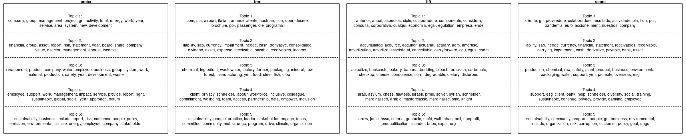
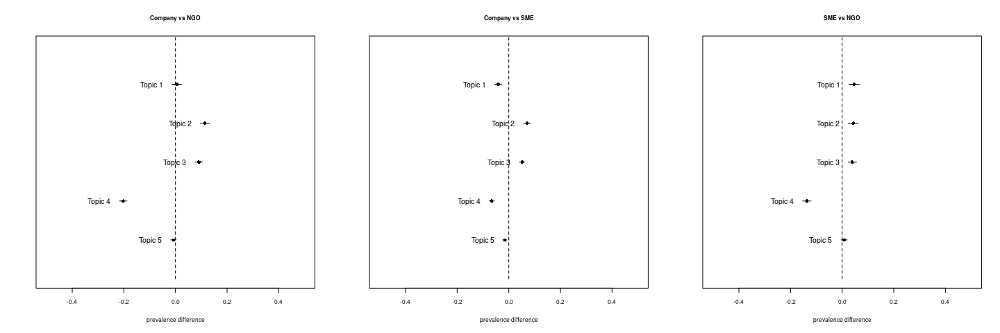

### Load data

``` r
library(arrow)
library(dplyr)

processed_data_path = "/mnt/Data/git_root/sustainability-reports-industry-analysis/data/processed.parquet"
data = arrow::read_parquet(processed_data_path)

data = data %>% 
  mutate(type = case_when(
    type == "SME" ~ "SME",
    type == "NGO Global" ~ "NGO",
    type == "NGO Local" ~ "NGO",
    type == "Company" ~ "Company",
    TRUE ~ "Other"
  )) %>% 
  filter(type != "Other")
```

### Preprocessing

``` r
library(stm)

processed = textProcessor(
  documents = data$reconstructed_text,
  metadata = data,
  lowercase = FALSE,
  removepunctuation = FALSE,
  removenumbers = FALSE,
  removestopwords = FALSE,
  stem = FALSE)
```

    ## Building corpus... 
    ## Creating Output...

``` r
out = prepDocuments(
  processed$documents,
  processed$vocab,
  processed$meta)

docs = out$documents
vocab = out$vocab
meta = out$meta
```

### STM

``` r
n=5
stm_model = stm(documents = docs, vocab = vocab,
      K = n, prevalence =~ type,
        data = meta, max.em.its = 750)
```

    ## Beginning Spectral Initialization 
    ##   Calculating the gram matrix...
    ##   Using only 10000 most frequent terms during initialization...
    ##   Finding anchor words...
    ##      .....
    ##   Recovering initialization...
    ##      ....................................................................................................
    ## Initialization complete.
    ## ....................................................................................................
    ## Completed E-Step (7 seconds). 
    ## Completed M-Step. 
    ## Completing Iteration 1 (approx. per word bound = -7.410) 
    ## ....................................................................................................
    ## Completed E-Step (6 seconds). 
    ## Completed M-Step. 
    ## Completing Iteration 2 (approx. per word bound = -7.401, relative change = 1.219e-03) 
    ## ....................................................................................................
    ## Completed E-Step (6 seconds). 
    ## Completed M-Step. 
    ## Completing Iteration 3 (approx. per word bound = -7.400, relative change = 7.159e-05) 
    ## ....................................................................................................
    ## Completed E-Step (6 seconds). 
    ## Completed M-Step. 
    ## Completing Iteration 4 (approx. per word bound = -7.399, relative change = 9.513e-05) 
    ## ....................................................................................................
    ## Completed E-Step (6 seconds). 
    ## Completed M-Step. 
    ## Completing Iteration 5 (approx. per word bound = -7.398, relative change = 1.503e-04) 
    ## Topic 1: management, total, risk, energy, standard 
    ##  Topic 2: company, asset, development, policy, increase 
    ##  Topic 3: report, work, environmental, sustainability, annual 
    ##  Topic 4: financial, company, emission, product, performance 
    ##  Topic 5: group, business, employee, include, year 
    ## ....................................................................................................
    ## Completed E-Step (6 seconds). 
    ## Completed M-Step. 
    ## Completing Iteration 6 (approx. per word bound = -7.396, relative change = 2.385e-04) 
    ## ....................................................................................................
    ## Completed E-Step (5 seconds). 
    ## Completed M-Step. 
    ## Completing Iteration 7 (approx. per word bound = -7.394, relative change = 3.665e-04) 
    ## ....................................................................................................
    ## Completed E-Step (5 seconds). 
    ## Completed M-Step. 
    ## Completing Iteration 8 (approx. per word bound = -7.390, relative change = 5.332e-04) 
    ## ....................................................................................................
    ## Completed E-Step (5 seconds). 
    ## Completed M-Step. 
    ## Completing Iteration 9 (approx. per word bound = -7.384, relative change = 7.253e-04) 
    ## ....................................................................................................
    ## Completed E-Step (5 seconds). 
    ## Completed M-Step. 
    ## Completing Iteration 10 (approx. per word bound = -7.378, relative change = 8.873e-04) 
    ## Topic 1: management, total, risk, energy, standard 
    ##  Topic 2: asset, company, report, income, non 
    ##  Topic 3: report, work, sustainability, environmental, people 
    ##  Topic 4: financial, company, statement, emission, product 
    ##  Topic 5: group, business, employee, include, year 
    ## ....................................................................................................
    ## Completed E-Step (5 seconds). 
    ## Completed M-Step. 
    ## Completing Iteration 11 (approx. per word bound = -7.371, relative change = 9.213e-04) 
    ## ....................................................................................................
    ## Completed E-Step (5 seconds). 
    ## Completed M-Step. 
    ## Completing Iteration 12 (approx. per word bound = -7.365, relative change = 8.287e-04) 
    ## ....................................................................................................
    ## Completed E-Step (5 seconds). 
    ## Completed M-Step. 
    ## Completing Iteration 13 (approx. per word bound = -7.360, relative change = 7.110e-04) 
    ## ....................................................................................................
    ## Completed E-Step (5 seconds). 
    ## Completed M-Step. 
    ## Completing Iteration 14 (approx. per word bound = -7.355, relative change = 6.169e-04) 
    ## ....................................................................................................
    ## Completed E-Step (5 seconds). 
    ## Completed M-Step. 
    ## Completing Iteration 15 (approx. per word bound = -7.351, relative change = 5.459e-04) 
    ## Topic 1: management, total, risk, energy, operation 
    ##  Topic 2: asset, report, company, income, liability 
    ##  Topic 3: report, work, sustainability, environmental, people 
    ##  Topic 4: financial, company, statement, emission, performance 
    ##  Topic 5: group, business, employee, include, year 
    ## ....................................................................................................
    ## Completed E-Step (5 seconds). 
    ## Completed M-Step. 
    ## Completing Iteration 16 (approx. per word bound = -7.348, relative change = 4.918e-04) 
    ## ....................................................................................................
    ## Completed E-Step (5 seconds). 
    ## Completed M-Step. 
    ## Completing Iteration 17 (approx. per word bound = -7.344, relative change = 4.544e-04) 
    ## ....................................................................................................
    ## Completed E-Step (5 seconds). 
    ## Completed M-Step. 
    ## Completing Iteration 18 (approx. per word bound = -7.341, relative change = 4.327e-04) 
    ## ....................................................................................................
    ## Completed E-Step (5 seconds). 
    ## Completed M-Step. 
    ## Completing Iteration 19 (approx. per word bound = -7.338, relative change = 4.210e-04) 
    ## ....................................................................................................
    ## Completed E-Step (5 seconds). 
    ## Completed M-Step. 
    ## Completing Iteration 20 (approx. per word bound = -7.335, relative change = 4.119e-04) 
    ## Topic 1: management, risk, total, operation, energy 
    ##  Topic 2: report, asset, income, liability, annual 
    ##  Topic 3: report, work, sustainability, environmental, company 
    ##  Topic 4: financial, company, statement, year, performance 
    ##  Topic 5: group, business, employee, include, year 
    ## ....................................................................................................
    ## Completed E-Step (5 seconds). 
    ## Completed M-Step. 
    ## Completing Iteration 21 (approx. per word bound = -7.332, relative change = 4.014e-04) 
    ## ....................................................................................................
    ## Completed E-Step (5 seconds). 
    ## Completed M-Step. 
    ## Completing Iteration 22 (approx. per word bound = -7.329, relative change = 3.878e-04) 
    ## ....................................................................................................
    ## Completed E-Step (5 seconds). 
    ## Completed M-Step. 
    ## Completing Iteration 23 (approx. per word bound = -7.326, relative change = 3.676e-04) 
    ## ....................................................................................................
    ## Completed E-Step (5 seconds). 
    ## Completed M-Step. 
    ## Completing Iteration 24 (approx. per word bound = -7.324, relative change = 3.391e-04) 
    ## ....................................................................................................
    ## Completed E-Step (5 seconds). 
    ## Completed M-Step. 
    ## Completing Iteration 25 (approx. per word bound = -7.322, relative change = 3.061e-04) 
    ## Topic 1: management, risk, total, value, operation 
    ##  Topic 2: report, asset, income, liability, annual 
    ##  Topic 3: report, work, company, environmental, sustainability 
    ##  Topic 4: financial, company, statement, board, year 
    ##  Topic 5: group, business, employee, include, service 
    ## ....................................................................................................
    ## Completed E-Step (5 seconds). 
    ## Completed M-Step. 
    ## Completing Iteration 26 (approx. per word bound = -7.320, relative change = 2.707e-04) 
    ## ....................................................................................................
    ## Completed E-Step (5 seconds). 
    ## Completed M-Step. 
    ## Completing Iteration 27 (approx. per word bound = -7.318, relative change = 2.324e-04) 
    ## ....................................................................................................
    ## Completed E-Step (5 seconds). 
    ## Completed M-Step. 
    ## Completing Iteration 28 (approx. per word bound = -7.317, relative change = 1.946e-04) 
    ## ....................................................................................................
    ## Completed E-Step (5 seconds). 
    ## Completed M-Step. 
    ## Completing Iteration 29 (approx. per word bound = -7.315, relative change = 1.626e-04) 
    ## ....................................................................................................
    ## Completed E-Step (5 seconds). 
    ## Completed M-Step. 
    ## Completing Iteration 30 (approx. per word bound = -7.314, relative change = 1.384e-04) 
    ## Topic 1: management, risk, total, value, operation 
    ##  Topic 2: report, asset, income, liability, annual 
    ##  Topic 3: report, company, work, environmental, sustainability 
    ##  Topic 4: financial, company, statement, board, year 
    ##  Topic 5: group, business, employee, include, year 
    ## ....................................................................................................
    ## Completed E-Step (6 seconds). 
    ## Completed M-Step. 
    ## Completing Iteration 31 (approx. per word bound = -7.314, relative change = 1.206e-04) 
    ## ....................................................................................................
    ## Completed E-Step (6 seconds). 
    ## Completed M-Step. 
    ## Completing Iteration 32 (approx. per word bound = -7.313, relative change = 1.076e-04) 
    ## ....................................................................................................
    ## Completed E-Step (6 seconds). 
    ## Completed M-Step. 
    ## Completing Iteration 33 (approx. per word bound = -7.312, relative change = 9.776e-05) 
    ## ....................................................................................................
    ## Completed E-Step (7 seconds). 
    ## Completed M-Step. 
    ## Completing Iteration 34 (approx. per word bound = -7.311, relative change = 9.054e-05) 
    ## ....................................................................................................
    ## Completed E-Step (6 seconds). 
    ## Completed M-Step. 
    ## Completing Iteration 35 (approx. per word bound = -7.311, relative change = 8.563e-05) 
    ## Topic 1: risk, management, total, value, sustainability 
    ##  Topic 2: report, asset, income, liability, annual 
    ##  Topic 3: report, company, work, environmental, sustainability 
    ##  Topic 4: financial, company, board, statement, year 
    ##  Topic 5: group, business, employee, include, year 
    ## ....................................................................................................
    ## Completed E-Step (6 seconds). 
    ## Completed M-Step. 
    ## Completing Iteration 36 (approx. per word bound = -7.310, relative change = 8.267e-05) 
    ## ....................................................................................................
    ## Completed E-Step (6 seconds). 
    ## Completed M-Step. 
    ## Completing Iteration 37 (approx. per word bound = -7.310, relative change = 8.110e-05) 
    ## ....................................................................................................
    ## Completed E-Step (6 seconds). 
    ## Completed M-Step. 
    ## Completing Iteration 38 (approx. per word bound = -7.309, relative change = 7.987e-05) 
    ## ....................................................................................................
    ## Completed E-Step (6 seconds). 
    ## Completed M-Step. 
    ## Completing Iteration 39 (approx. per word bound = -7.308, relative change = 7.812e-05) 
    ## ....................................................................................................
    ## Completed E-Step (6 seconds). 
    ## Completed M-Step. 
    ## Completing Iteration 40 (approx. per word bound = -7.308, relative change = 7.523e-05) 
    ## Topic 1: risk, management, total, value, sustainability 
    ##  Topic 2: asset, report, income, liability, group 
    ##  Topic 3: report, company, work, environmental, sustainability 
    ##  Topic 4: financial, board, company, statement, market 
    ##  Topic 5: business, group, employee, include, year 
    ## ....................................................................................................
    ## Completed E-Step (6 seconds). 
    ## Completed M-Step. 
    ## Completing Iteration 41 (approx. per word bound = -7.307, relative change = 7.170e-05) 
    ## ....................................................................................................
    ## Completed E-Step (6 seconds). 
    ## Completed M-Step. 
    ## Completing Iteration 42 (approx. per word bound = -7.307, relative change = 6.816e-05) 
    ## ....................................................................................................
    ## Completed E-Step (6 seconds). 
    ## Completed M-Step. 
    ## Completing Iteration 43 (approx. per word bound = -7.306, relative change = 6.532e-05) 
    ## ....................................................................................................
    ## Completed E-Step (6 seconds). 
    ## Completed M-Step. 
    ## Completing Iteration 44 (approx. per word bound = -7.306, relative change = 6.333e-05) 
    ## ....................................................................................................
    ## Completed E-Step (6 seconds). 
    ## Completed M-Step. 
    ## Completing Iteration 45 (approx. per word bound = -7.305, relative change = 6.202e-05) 
    ## Topic 1: risk, management, total, sustainability, operation 
    ##  Topic 2: asset, report, group, income, company 
    ##  Topic 3: report, company, work, environmental, sustainability 
    ##  Topic 4: financial, board, company, statement, market 
    ##  Topic 5: business, employee, group, include, management 
    ## ....................................................................................................
    ## Completed E-Step (6 seconds). 
    ## Completed M-Step. 
    ## Completing Iteration 46 (approx. per word bound = -7.305, relative change = 6.108e-05) 
    ## ....................................................................................................
    ## Completed E-Step (6 seconds). 
    ## Completed M-Step. 
    ## Completing Iteration 47 (approx. per word bound = -7.305, relative change = 6.039e-05) 
    ## ....................................................................................................
    ## Completed E-Step (6 seconds). 
    ## Completed M-Step. 
    ## Completing Iteration 48 (approx. per word bound = -7.304, relative change = 5.986e-05) 
    ## ....................................................................................................
    ## Completed E-Step (6 seconds). 
    ## Completed M-Step. 
    ## Completing Iteration 49 (approx. per word bound = -7.304, relative change = 5.959e-05) 
    ## ....................................................................................................
    ## Completed E-Step (6 seconds). 
    ## Completed M-Step. 
    ## Completing Iteration 50 (approx. per word bound = -7.303, relative change = 5.962e-05) 
    ## Topic 1: risk, management, total, sustainability, operation 
    ##  Topic 2: asset, report, group, financial, company 
    ##  Topic 3: report, company, work, sustainability, environmental 
    ##  Topic 4: financial, board, company, statement, director 
    ##  Topic 5: business, employee, group, management, include 
    ## ....................................................................................................
    ## Completed E-Step (6 seconds). 
    ## Completed M-Step. 
    ## Completing Iteration 51 (approx. per word bound = -7.303, relative change = 5.995e-05) 
    ## ....................................................................................................
    ## Completed E-Step (6 seconds). 
    ## Completed M-Step. 
    ## Completing Iteration 52 (approx. per word bound = -7.302, relative change = 6.048e-05) 
    ## ....................................................................................................
    ## Completed E-Step (6 seconds). 
    ## Completed M-Step. 
    ## Completing Iteration 53 (approx. per word bound = -7.302, relative change = 6.116e-05) 
    ## ....................................................................................................
    ## Completed E-Step (6 seconds). 
    ## Completed M-Step. 
    ## Completing Iteration 54 (approx. per word bound = -7.301, relative change = 6.191e-05) 
    ## ....................................................................................................
    ## Completed E-Step (6 seconds). 
    ## Completed M-Step. 
    ## Completing Iteration 55 (approx. per word bound = -7.301, relative change = 6.266e-05) 
    ## Topic 1: risk, total, management, sustainability, operation 
    ##  Topic 2: asset, group, financial, report, company 
    ##  Topic 3: company, report, work, sustainability, environmental 
    ##  Topic 4: financial, board, company, statement, information 
    ##  Topic 5: business, employee, group, management, include 
    ## ....................................................................................................
    ## Completed E-Step (6 seconds). 
    ## Completed M-Step. 
    ## Completing Iteration 56 (approx. per word bound = -7.301, relative change = 6.335e-05) 
    ## ....................................................................................................
    ## Completed E-Step (6 seconds). 
    ## Completed M-Step. 
    ## Completing Iteration 57 (approx. per word bound = -7.300, relative change = 6.398e-05) 
    ## ....................................................................................................
    ## Completed E-Step (6 seconds). 
    ## Completed M-Step. 
    ## Completing Iteration 58 (approx. per word bound = -7.300, relative change = 6.454e-05) 
    ## ....................................................................................................
    ## Completed E-Step (6 seconds). 
    ## Completed M-Step. 
    ## Completing Iteration 59 (approx. per word bound = -7.299, relative change = 6.509e-05) 
    ## ....................................................................................................
    ## Completed E-Step (6 seconds). 
    ## Completed M-Step. 
    ## Completing Iteration 60 (approx. per word bound = -7.299, relative change = 6.555e-05) 
    ## Topic 1: risk, total, management, sustainability, energy 
    ##  Topic 2: asset, financial, group, report, company 
    ##  Topic 3: company, report, work, sustainability, environmental 
    ##  Topic 4: financial, board, company, statement, information 
    ##  Topic 5: business, employee, management, group, include 
    ## ....................................................................................................
    ## Completed E-Step (6 seconds). 
    ## Completed M-Step. 
    ## Completing Iteration 61 (approx. per word bound = -7.298, relative change = 6.598e-05) 
    ## ....................................................................................................
    ## Completed E-Step (6 seconds). 
    ## Completed M-Step. 
    ## Completing Iteration 62 (approx. per word bound = -7.298, relative change = 6.640e-05) 
    ## ....................................................................................................
    ## Completed E-Step (6 seconds). 
    ## Completed M-Step. 
    ## Completing Iteration 63 (approx. per word bound = -7.297, relative change = 6.672e-05) 
    ## ....................................................................................................
    ## Completed E-Step (6 seconds). 
    ## Completed M-Step. 
    ## Completing Iteration 64 (approx. per word bound = -7.297, relative change = 6.700e-05) 
    ## ....................................................................................................
    ## Completed E-Step (6 seconds). 
    ## Completed M-Step. 
    ## Completing Iteration 65 (approx. per word bound = -7.296, relative change = 6.727e-05) 
    ## Topic 1: risk, sustainability, management, total, energy 
    ##  Topic 2: financial, asset, group, company, report 
    ##  Topic 3: company, report, work, sustainability, environmental 
    ##  Topic 4: financial, board, company, information, statement 
    ##  Topic 5: business, employee, management, group, include 
    ## ....................................................................................................
    ## Completed E-Step (6 seconds). 
    ## Completed M-Step. 
    ## Completing Iteration 66 (approx. per word bound = -7.296, relative change = 6.753e-05) 
    ## ....................................................................................................
    ## Completed E-Step (6 seconds). 
    ## Completed M-Step. 
    ## Completing Iteration 67 (approx. per word bound = -7.295, relative change = 6.783e-05) 
    ## ....................................................................................................
    ## Completed E-Step (6 seconds). 
    ## Completed M-Step. 
    ## Completing Iteration 68 (approx. per word bound = -7.295, relative change = 6.824e-05) 
    ## ....................................................................................................
    ## Completed E-Step (5 seconds). 
    ## Completed M-Step. 
    ## Completing Iteration 69 (approx. per word bound = -7.294, relative change = 6.864e-05) 
    ## ....................................................................................................
    ## Completed E-Step (6 seconds). 
    ## Completed M-Step. 
    ## Completing Iteration 70 (approx. per word bound = -7.294, relative change = 6.912e-05) 
    ## Topic 1: risk, sustainability, energy, management, total 
    ##  Topic 2: financial, asset, group, company, report 
    ##  Topic 3: company, report, work, sustainability, environmental 
    ##  Topic 4: financial, board, information, report, statement 
    ##  Topic 5: business, management, employee, group, include 
    ## ....................................................................................................
    ## Completed E-Step (5 seconds). 
    ## Completed M-Step. 
    ## Completing Iteration 71 (approx. per word bound = -7.293, relative change = 6.953e-05) 
    ## ....................................................................................................
    ## Completed E-Step (5 seconds). 
    ## Completed M-Step. 
    ## Completing Iteration 72 (approx. per word bound = -7.293, relative change = 6.985e-05) 
    ## ....................................................................................................
    ## Completed E-Step (5 seconds). 
    ## Completed M-Step. 
    ## Completing Iteration 73 (approx. per word bound = -7.292, relative change = 7.006e-05) 
    ## ....................................................................................................
    ## Completed E-Step (5 seconds). 
    ## Completed M-Step. 
    ## Completing Iteration 74 (approx. per word bound = -7.292, relative change = 7.013e-05) 
    ## ....................................................................................................
    ## Completed E-Step (5 seconds). 
    ## Completed M-Step. 
    ## Completing Iteration 75 (approx. per word bound = -7.291, relative change = 7.009e-05) 
    ## Topic 1: energy, sustainability, risk, total, management 
    ##  Topic 2: financial, asset, group, company, year 
    ##  Topic 3: company, report, work, sustainability, environmental 
    ##  Topic 4: financial, information, report, board, statement 
    ##  Topic 5: business, management, employee, group, include 
    ## ....................................................................................................
    ## Completed E-Step (5 seconds). 
    ## Completed M-Step. 
    ## Completing Iteration 76 (approx. per word bound = -7.291, relative change = 6.984e-05) 
    ## ....................................................................................................
    ## Completed E-Step (5 seconds). 
    ## Completed M-Step. 
    ## Completing Iteration 77 (approx. per word bound = -7.290, relative change = 6.933e-05) 
    ## ....................................................................................................
    ## Completed E-Step (6 seconds). 
    ## Completed M-Step. 
    ## Completing Iteration 78 (approx. per word bound = -7.290, relative change = 6.875e-05) 
    ## ....................................................................................................
    ## Completed E-Step (5 seconds). 
    ## Completed M-Step. 
    ## Completing Iteration 79 (approx. per word bound = -7.289, relative change = 6.818e-05) 
    ## ....................................................................................................
    ## Completed E-Step (6 seconds). 
    ## Completed M-Step. 
    ## Completing Iteration 80 (approx. per word bound = -7.289, relative change = 6.766e-05) 
    ## Topic 1: energy, sustainability, total, risk, management 
    ##  Topic 2: financial, asset, group, company, year 
    ##  Topic 3: company, report, work, sustainability, emission 
    ##  Topic 4: financial, information, report, statement, board 
    ##  Topic 5: business, management, employee, group, include 
    ## ....................................................................................................
    ## Completed E-Step (6 seconds). 
    ## Completed M-Step. 
    ## Completing Iteration 81 (approx. per word bound = -7.288, relative change = 6.724e-05) 
    ## ....................................................................................................
    ## Completed E-Step (5 seconds). 
    ## Completed M-Step. 
    ## Completing Iteration 82 (approx. per word bound = -7.288, relative change = 6.703e-05) 
    ## ....................................................................................................
    ## Completed E-Step (6 seconds). 
    ## Completed M-Step. 
    ## Completing Iteration 83 (approx. per word bound = -7.287, relative change = 6.730e-05) 
    ## ....................................................................................................
    ## Completed E-Step (6 seconds). 
    ## Completed M-Step. 
    ## Completing Iteration 84 (approx. per word bound = -7.287, relative change = 6.800e-05) 
    ## ....................................................................................................
    ## Completed E-Step (6 seconds). 
    ## Completed M-Step. 
    ## Completing Iteration 85 (approx. per word bound = -7.286, relative change = 6.756e-05) 
    ## Topic 1: energy, sustainability, total, plant, emission 
    ##  Topic 2: financial, asset, group, company, year 
    ##  Topic 3: report, company, work, sustainability, community 
    ##  Topic 4: financial, information, report, statement, board 
    ##  Topic 5: business, management, employee, group, year 
    ## ....................................................................................................
    ## Completed E-Step (6 seconds). 
    ## Completed M-Step. 
    ## Completing Iteration 86 (approx. per word bound = -7.286, relative change = 6.582e-05) 
    ## ....................................................................................................
    ## Completed E-Step (6 seconds). 
    ## Completed M-Step. 
    ## Completing Iteration 87 (approx. per word bound = -7.285, relative change = 6.434e-05) 
    ## ....................................................................................................
    ## Completed E-Step (5 seconds). 
    ## Completed M-Step. 
    ## Completing Iteration 88 (approx. per word bound = -7.285, relative change = 6.324e-05) 
    ## ....................................................................................................
    ## Completed E-Step (6 seconds). 
    ## Completed M-Step. 
    ## Completing Iteration 89 (approx. per word bound = -7.284, relative change = 6.202e-05) 
    ## ....................................................................................................
    ## Completed E-Step (6 seconds). 
    ## Completed M-Step. 
    ## Completing Iteration 90 (approx. per word bound = -7.284, relative change = 6.034e-05) 
    ## Topic 1: energy, sustainability, total, emission, production 
    ##  Topic 2: financial, asset, group, company, year 
    ##  Topic 3: report, work, sustainability, company, community 
    ##  Topic 4: financial, information, report, statement, board 
    ##  Topic 5: business, management, employee, group, year 
    ## ....................................................................................................
    ## Completed E-Step (6 seconds). 
    ## Completed M-Step. 
    ## Completing Iteration 91 (approx. per word bound = -7.284, relative change = 5.864e-05) 
    ## ....................................................................................................
    ## Completed E-Step (6 seconds). 
    ## Completed M-Step. 
    ## Completing Iteration 92 (approx. per word bound = -7.283, relative change = 5.735e-05) 
    ## ....................................................................................................
    ## Completed E-Step (6 seconds). 
    ## Completed M-Step. 
    ## Completing Iteration 93 (approx. per word bound = -7.283, relative change = 5.542e-05) 
    ## ....................................................................................................
    ## Completed E-Step (6 seconds). 
    ## Completed M-Step. 
    ## Completing Iteration 94 (approx. per word bound = -7.282, relative change = 5.272e-05) 
    ## ....................................................................................................
    ## Completed E-Step (6 seconds). 
    ## Completed M-Step. 
    ## Completing Iteration 95 (approx. per word bound = -7.282, relative change = 5.047e-05) 
    ## Topic 1: energy, sustainability, total, production, emission 
    ##  Topic 2: financial, asset, group, company, year 
    ##  Topic 3: report, sustainability, work, community, support 
    ##  Topic 4: financial, information, report, management, statement 
    ##  Topic 5: business, management, employee, group, company 
    ## ....................................................................................................
    ## Completed E-Step (6 seconds). 
    ## Completed M-Step. 
    ## Completing Iteration 96 (approx. per word bound = -7.282, relative change = 4.863e-05) 
    ## ....................................................................................................
    ## Completed E-Step (6 seconds). 
    ## Completed M-Step. 
    ## Completing Iteration 97 (approx. per word bound = -7.281, relative change = 4.705e-05) 
    ## ....................................................................................................
    ## Completed E-Step (6 seconds). 
    ## Completed M-Step. 
    ## Completing Iteration 98 (approx. per word bound = -7.281, relative change = 4.561e-05) 
    ## ....................................................................................................
    ## Completed E-Step (6 seconds). 
    ## Completed M-Step. 
    ## Completing Iteration 99 (approx. per word bound = -7.281, relative change = 4.426e-05) 
    ## ....................................................................................................
    ## Completed E-Step (6 seconds). 
    ## Completed M-Step. 
    ## Completing Iteration 100 (approx. per word bound = -7.280, relative change = 4.302e-05) 
    ## Topic 1: energy, sustainability, project, total, production 
    ##  Topic 2: financial, asset, group, company, year 
    ##  Topic 3: report, sustainability, work, community, support 
    ##  Topic 4: financial, information, report, management, service 
    ##  Topic 5: business, management, employee, company, group 
    ## ....................................................................................................
    ## Completed E-Step (5 seconds). 
    ## Completed M-Step. 
    ## Completing Iteration 101 (approx. per word bound = -7.280, relative change = 4.180e-05) 
    ## ....................................................................................................
    ## Completed E-Step (6 seconds). 
    ## Completed M-Step. 
    ## Completing Iteration 102 (approx. per word bound = -7.280, relative change = 4.062e-05) 
    ## ....................................................................................................
    ## Completed E-Step (6 seconds). 
    ## Completed M-Step. 
    ## Completing Iteration 103 (approx. per word bound = -7.279, relative change = 3.950e-05) 
    ## ....................................................................................................
    ## Completed E-Step (6 seconds). 
    ## Completed M-Step. 
    ## Completing Iteration 104 (approx. per word bound = -7.279, relative change = 3.850e-05) 
    ## ....................................................................................................
    ## Completed E-Step (5 seconds). 
    ## Completed M-Step. 
    ## Completing Iteration 105 (approx. per word bound = -7.279, relative change = 3.759e-05) 
    ## Topic 1: energy, sustainability, project, emission, production 
    ##  Topic 2: financial, asset, group, company, year 
    ##  Topic 3: report, sustainability, work, community, support 
    ##  Topic 4: financial, information, report, management, service 
    ##  Topic 5: business, management, company, employee, group 
    ## ....................................................................................................
    ## Completed E-Step (5 seconds). 
    ## Completed M-Step. 
    ## Completing Iteration 106 (approx. per word bound = -7.279, relative change = 3.675e-05) 
    ## ....................................................................................................
    ## Completed E-Step (5 seconds). 
    ## Completed M-Step. 
    ## Completing Iteration 107 (approx. per word bound = -7.278, relative change = 3.603e-05) 
    ## ....................................................................................................
    ## Completed E-Step (5 seconds). 
    ## Completed M-Step. 
    ## Completing Iteration 108 (approx. per word bound = -7.278, relative change = 3.538e-05) 
    ## ....................................................................................................
    ## Completed E-Step (5 seconds). 
    ## Completed M-Step. 
    ## Completing Iteration 109 (approx. per word bound = -7.278, relative change = 3.474e-05) 
    ## ....................................................................................................
    ## Completed E-Step (5 seconds). 
    ## Completed M-Step. 
    ## Completing Iteration 110 (approx. per word bound = -7.278, relative change = 3.411e-05) 
    ## Topic 1: energy, sustainability, project, emission, production 
    ##  Topic 2: financial, asset, group, year, company 
    ##  Topic 3: report, sustainability, work, community, employee 
    ##  Topic 4: financial, information, report, management, service 
    ##  Topic 5: business, management, company, employee, group 
    ## ....................................................................................................
    ## Completed E-Step (5 seconds). 
    ## Completed M-Step. 
    ## Completing Iteration 111 (approx. per word bound = -7.277, relative change = 3.344e-05) 
    ## ....................................................................................................
    ## Completed E-Step (5 seconds). 
    ## Completed M-Step. 
    ## Completing Iteration 112 (approx. per word bound = -7.277, relative change = 3.266e-05) 
    ## ....................................................................................................
    ## Completed E-Step (5 seconds). 
    ## Completed M-Step. 
    ## Completing Iteration 113 (approx. per word bound = -7.277, relative change = 3.177e-05) 
    ## ....................................................................................................
    ## Completed E-Step (5 seconds). 
    ## Completed M-Step. 
    ## Completing Iteration 114 (approx. per word bound = -7.277, relative change = 3.079e-05) 
    ## ....................................................................................................
    ## Completed E-Step (5 seconds). 
    ## Completed M-Step. 
    ## Completing Iteration 115 (approx. per word bound = -7.276, relative change = 2.975e-05) 
    ## Topic 1: energy, sustainability, project, emission, production 
    ##  Topic 2: financial, asset, group, year, company 
    ##  Topic 3: report, sustainability, work, community, employee 
    ##  Topic 4: financial, information, report, management, service 
    ##  Topic 5: business, management, company, employee, group 
    ## ....................................................................................................
    ## Completed E-Step (5 seconds). 
    ## Completed M-Step. 
    ## Completing Iteration 116 (approx. per word bound = -7.276, relative change = 2.872e-05) 
    ## ....................................................................................................
    ## Completed E-Step (5 seconds). 
    ## Completed M-Step. 
    ## Completing Iteration 117 (approx. per word bound = -7.276, relative change = 2.777e-05) 
    ## ....................................................................................................
    ## Completed E-Step (5 seconds). 
    ## Completed M-Step. 
    ## Completing Iteration 118 (approx. per word bound = -7.276, relative change = 2.692e-05) 
    ## ....................................................................................................
    ## Completed E-Step (5 seconds). 
    ## Completed M-Step. 
    ## Completing Iteration 119 (approx. per word bound = -7.276, relative change = 2.619e-05) 
    ## ....................................................................................................
    ## Completed E-Step (5 seconds). 
    ## Completed M-Step. 
    ## Completing Iteration 120 (approx. per word bound = -7.275, relative change = 2.554e-05) 
    ## Topic 1: energy, sustainability, project, emission, production 
    ##  Topic 2: financial, asset, group, company, year 
    ##  Topic 3: report, sustainability, work, employee, community 
    ##  Topic 4: financial, information, report, management, group 
    ##  Topic 5: business, management, company, employee, group 
    ## ....................................................................................................
    ## Completed E-Step (5 seconds). 
    ## Completed M-Step. 
    ## Completing Iteration 121 (approx. per word bound = -7.275, relative change = 2.495e-05) 
    ## ....................................................................................................
    ## Completed E-Step (5 seconds). 
    ## Completed M-Step. 
    ## Completing Iteration 122 (approx. per word bound = -7.275, relative change = 2.438e-05) 
    ## ....................................................................................................
    ## Completed E-Step (5 seconds). 
    ## Completed M-Step. 
    ## Completing Iteration 123 (approx. per word bound = -7.275, relative change = 2.381e-05) 
    ## ....................................................................................................
    ## Completed E-Step (5 seconds). 
    ## Completed M-Step. 
    ## Completing Iteration 124 (approx. per word bound = -7.275, relative change = 2.325e-05) 
    ## ....................................................................................................
    ## Completed E-Step (5 seconds). 
    ## Completed M-Step. 
    ## Completing Iteration 125 (approx. per word bound = -7.275, relative change = 2.273e-05) 
    ## Topic 1: energy, sustainability, report, project, emission 
    ##  Topic 2: financial, asset, group, company, year 
    ##  Topic 3: report, work, sustainability, employee, community 
    ##  Topic 4: financial, information, management, report, group 
    ##  Topic 5: management, business, company, employee, group 
    ## ....................................................................................................
    ## Completed E-Step (5 seconds). 
    ## Completed M-Step. 
    ## Completing Iteration 126 (approx. per word bound = -7.274, relative change = 2.224e-05) 
    ## ....................................................................................................
    ## Completed E-Step (5 seconds). 
    ## Completed M-Step. 
    ## Completing Iteration 127 (approx. per word bound = -7.274, relative change = 2.180e-05) 
    ## ....................................................................................................
    ## Completed E-Step (5 seconds). 
    ## Completed M-Step. 
    ## Completing Iteration 128 (approx. per word bound = -7.274, relative change = 2.137e-05) 
    ## ....................................................................................................
    ## Completed E-Step (5 seconds). 
    ## Completed M-Step. 
    ## Completing Iteration 129 (approx. per word bound = -7.274, relative change = 2.098e-05) 
    ## ....................................................................................................
    ## Completed E-Step (5 seconds). 
    ## Completed M-Step. 
    ## Completing Iteration 130 (approx. per word bound = -7.274, relative change = 2.059e-05) 
    ## Topic 1: energy, sustainability, report, project, emission 
    ##  Topic 2: financial, asset, group, year, company 
    ##  Topic 3: report, work, sustainability, employee, community 
    ##  Topic 4: financial, management, report, information, group 
    ##  Topic 5: management, business, company, employee, group 
    ## ....................................................................................................
    ## Completed E-Step (5 seconds). 
    ## Completed M-Step. 
    ## Completing Iteration 131 (approx. per word bound = -7.274, relative change = 2.020e-05) 
    ## ....................................................................................................
    ## Completed E-Step (5 seconds). 
    ## Completed M-Step. 
    ## Completing Iteration 132 (approx. per word bound = -7.273, relative change = 1.982e-05) 
    ## ....................................................................................................
    ## Completed E-Step (5 seconds). 
    ## Completed M-Step. 
    ## Completing Iteration 133 (approx. per word bound = -7.273, relative change = 1.944e-05) 
    ## ....................................................................................................
    ## Completed E-Step (5 seconds). 
    ## Completed M-Step. 
    ## Completing Iteration 134 (approx. per word bound = -7.273, relative change = 1.913e-05) 
    ## ....................................................................................................
    ## Completed E-Step (5 seconds). 
    ## Completed M-Step. 
    ## Completing Iteration 135 (approx. per word bound = -7.273, relative change = 1.885e-05) 
    ## Topic 1: energy, sustainability, report, project, emission 
    ##  Topic 2: financial, asset, group, year, company 
    ##  Topic 3: work, report, sustainability, employee, community 
    ##  Topic 4: financial, report, management, information, group 
    ##  Topic 5: management, business, company, employee, group 
    ## ....................................................................................................
    ## Completed E-Step (5 seconds). 
    ## Completed M-Step. 
    ## Completing Iteration 136 (approx. per word bound = -7.273, relative change = 1.863e-05) 
    ## ....................................................................................................
    ## Completed E-Step (4 seconds). 
    ## Completed M-Step. 
    ## Completing Iteration 137 (approx. per word bound = -7.273, relative change = 1.848e-05) 
    ## ....................................................................................................
    ## Completed E-Step (5 seconds). 
    ## Completed M-Step. 
    ## Completing Iteration 138 (approx. per word bound = -7.273, relative change = 1.837e-05) 
    ## ....................................................................................................
    ## Completed E-Step (5 seconds). 
    ## Completed M-Step. 
    ## Completing Iteration 139 (approx. per word bound = -7.273, relative change = 1.830e-05) 
    ## ....................................................................................................
    ## Completed E-Step (4 seconds). 
    ## Completed M-Step. 
    ## Completing Iteration 140 (approx. per word bound = -7.272, relative change = 1.826e-05) 
    ## Topic 1: energy, sustainability, report, project, emission 
    ##  Topic 2: financial, asset, group, year, company 
    ##  Topic 3: work, report, employee, sustainability, support 
    ##  Topic 4: financial, report, information, management, group 
    ##  Topic 5: management, business, company, employee, group 
    ## ....................................................................................................
    ## Completed E-Step (5 seconds). 
    ## Completed M-Step. 
    ## Completing Iteration 141 (approx. per word bound = -7.272, relative change = 1.823e-05) 
    ## ....................................................................................................
    ## Completed E-Step (5 seconds). 
    ## Completed M-Step. 
    ## Completing Iteration 142 (approx. per word bound = -7.272, relative change = 1.821e-05) 
    ## ....................................................................................................
    ## Completed E-Step (5 seconds). 
    ## Completed M-Step. 
    ## Completing Iteration 143 (approx. per word bound = -7.272, relative change = 1.816e-05) 
    ## ....................................................................................................
    ## Completed E-Step (5 seconds). 
    ## Completed M-Step. 
    ## Completing Iteration 144 (approx. per word bound = -7.272, relative change = 1.803e-05) 
    ## ....................................................................................................
    ## Completed E-Step (5 seconds). 
    ## Completed M-Step. 
    ## Completing Iteration 145 (approx. per word bound = -7.272, relative change = 1.779e-05) 
    ## Topic 1: energy, sustainability, report, emission, project 
    ##  Topic 2: financial, asset, group, year, company 
    ##  Topic 3: employee, work, report, sustainability, support 
    ##  Topic 4: financial, report, information, management, group 
    ##  Topic 5: management, business, employee, company, group 
    ## ....................................................................................................
    ## Completed E-Step (5 seconds). 
    ## Completed M-Step. 
    ## Completing Iteration 146 (approx. per word bound = -7.272, relative change = 1.735e-05) 
    ## ....................................................................................................
    ## Completed E-Step (4 seconds). 
    ## Completed M-Step. 
    ## Completing Iteration 147 (approx. per word bound = -7.271, relative change = 1.674e-05) 
    ## ....................................................................................................
    ## Completed E-Step (5 seconds). 
    ## Completed M-Step. 
    ## Completing Iteration 148 (approx. per word bound = -7.271, relative change = 1.596e-05) 
    ## ....................................................................................................
    ## Completed E-Step (5 seconds). 
    ## Completed M-Step. 
    ## Completing Iteration 149 (approx. per word bound = -7.271, relative change = 1.523e-05) 
    ## ....................................................................................................
    ## Completed E-Step (4 seconds). 
    ## Completed M-Step. 
    ## Completing Iteration 150 (approx. per word bound = -7.271, relative change = 1.452e-05) 
    ## Topic 1: energy, report, sustainability, company, emission 
    ##  Topic 2: financial, asset, group, year, company 
    ##  Topic 3: employee, work, report, sustainability, support 
    ##  Topic 4: financial, report, information, management, group 
    ##  Topic 5: management, business, employee, company, group 
    ## ....................................................................................................
    ## Completed E-Step (4 seconds). 
    ## Completed M-Step. 
    ## Completing Iteration 151 (approx. per word bound = -7.271, relative change = 1.389e-05) 
    ## ....................................................................................................
    ## Completed E-Step (5 seconds). 
    ## Completed M-Step. 
    ## Completing Iteration 152 (approx. per word bound = -7.271, relative change = 1.334e-05) 
    ## ....................................................................................................
    ## Completed E-Step (5 seconds). 
    ## Completed M-Step. 
    ## Completing Iteration 153 (approx. per word bound = -7.271, relative change = 1.288e-05) 
    ## ....................................................................................................
    ## Completed E-Step (4 seconds). 
    ## Completed M-Step. 
    ## Completing Iteration 154 (approx. per word bound = -7.271, relative change = 1.249e-05) 
    ## ....................................................................................................
    ## Completed E-Step (4 seconds). 
    ## Completed M-Step. 
    ## Completing Iteration 155 (approx. per word bound = -7.271, relative change = 1.214e-05) 
    ## Topic 1: energy, report, sustainability, company, management 
    ##  Topic 2: financial, asset, group, year, company 
    ##  Topic 3: employee, work, report, sustainability, support 
    ##  Topic 4: financial, report, information, management, group 
    ##  Topic 5: management, business, employee, company, group 
    ## ....................................................................................................
    ## Completed E-Step (4 seconds). 
    ## Completed M-Step. 
    ## Completing Iteration 156 (approx. per word bound = -7.271, relative change = 1.173e-05) 
    ## ....................................................................................................
    ## Completed E-Step (5 seconds). 
    ## Completed M-Step. 
    ## Completing Iteration 157 (approx. per word bound = -7.271, relative change = 1.129e-05) 
    ## ....................................................................................................
    ## Completed E-Step (4 seconds). 
    ## Completed M-Step. 
    ## Completing Iteration 158 (approx. per word bound = -7.270, relative change = 1.088e-05) 
    ## ....................................................................................................
    ## Completed E-Step (4 seconds). 
    ## Completed M-Step. 
    ## Completing Iteration 159 (approx. per word bound = -7.270, relative change = 1.053e-05) 
    ## ....................................................................................................
    ## Completed E-Step (4 seconds). 
    ## Completed M-Step. 
    ## Completing Iteration 160 (approx. per word bound = -7.270, relative change = 1.021e-05) 
    ## Topic 1: energy, report, sustainability, company, management 
    ##  Topic 2: financial, asset, group, year, company 
    ##  Topic 3: employee, work, report, sustainability, support 
    ##  Topic 4: financial, report, information, management, group 
    ##  Topic 5: management, employee, business, company, group 
    ## ....................................................................................................
    ## Completed E-Step (4 seconds). 
    ## Completed M-Step. 
    ## Model Converged

### Summary

``` r
model_info = sprintf(
  "We fit a topic model with %i topics, %i documents and a %i word dictionary.\nIn addition, the model's semantic coherence is %f and its exclusivity is %f. \n", 
  stm_model$settings$dim$K, stm_model$settings$dim$N, stm_model$settings$dim$V,
  mean(semanticCoherence(stm_model, out$documents)), mean(exclusivity(stm_model)))
print(model_info)
```

    ## [1] "We fit a topic model with 5 topics, 5836 documents and a 11934 word dictionary.\nIn addition, the model's semantic coherence is -9.026380 and its exclusivity is 8.469457. \n"

``` r
topic_prevalence = data.frame(topic=paste0("Topic ", 1:n),
  prevalence=stm_model$theta%>%colMeans()) %>% arrange(prevalence)
par(mar=c(4,6,1,1))
barplot(topic_prevalence$prevalence, names.arg=topic_prevalence$topic,
  horiz=T, las=1, xlim=c(0,0.5), xlab="expected topic proportion")
```


``` r
par(mfrow=c(1,4), mar=c(1,1,1,1))
plot(stm_model, type="labels", labeltype = "prob", main="proba",
  cex.main=1.3, text.cex=1.3, n=15)
plot(stm_model, type="labels", labeltype = "frex", main="frex",
  cex.main=1.3, text.cex=1.3, n=15)
plot(stm_model, type="labels", labeltype = "lift", main="lift",
  cex.main=1.3, text.cex=1.3, n=15)
plot(stm_model, type="labels", labeltype = "score", main="score",
  cex.main=1.3, text.cex=1.3, n=15)
```



### Differences

``` r
estimated_effects = estimateEffect(~type, stm_model,
    meta=out$meta, documents=out$documents, uncertainty="Global", nsims=250)

par(mfrow=c(1,3))
plot(estimated_effects, model=stm_model, topics=1:n, method="difference",
  covariate="type", cov.value1="Company", cov.value2 = "NGO",
  xlim=c(-0.5,0.5), verbose.labels=F, main="Company vs NGO",
  labeltype="custom", custom.labels = paste0("Topic ", 1:n),
  xlab = "prevalence difference", cex.main=0.8, cex.axis=0.8, cex.lab=0.8)

plot(estimated_effects, model=stm_model, topics=1:n, method="difference",
  covariate="type", cov.value1="Company", cov.value2 = "SME",
  xlim=c(-0.5,0.5), verbose.labels=F, main="Company vs SME",
  labeltype="custom", custom.labels = paste0("Topic ", 1:n),
  xlab = "prevalence difference", cex.main=0.8, cex.axis=0.8, cex.lab=0.8)

plot(estimated_effects, model=stm_model, topics=1:n, method="difference",
  covariate="type", cov.value1="SME", cov.value2 = "NGO",
  xlim=c(-0.5,0.5), verbose.labels=F, main="SME vs NGO",
  labeltype="custom", custom.labels = paste0("Topic ", 1:n),
  xlab = "prevalence difference", cex.main=0.8, cex.axis=0.8, cex.lab=0.8)
```



### Sectoral differences

``` r
sector_prevalence = stm_model$theta %>% as.data.frame() %>%
  mutate(sector=data$sector) %>% group_by(sector) %>%
  dplyr::summarise(across(everything(), mean), n=n()) %>%
  arrange(desc(n))

par(mfrow=c(2,5))
for (i in 1:10){
  sector = sector_prevalence$sector[i]
  np = n+1
  #par(mar=c(4,6,4,1))
  barplot(as.matrix(sector_prevalence[i, np:2]),
          names.ar =paste0("Topic ", n:1), xlim=c(0,.6),
          col="gray", horiz=T, las=1, xlab="expected topical prevalence", main=sector)}
```


