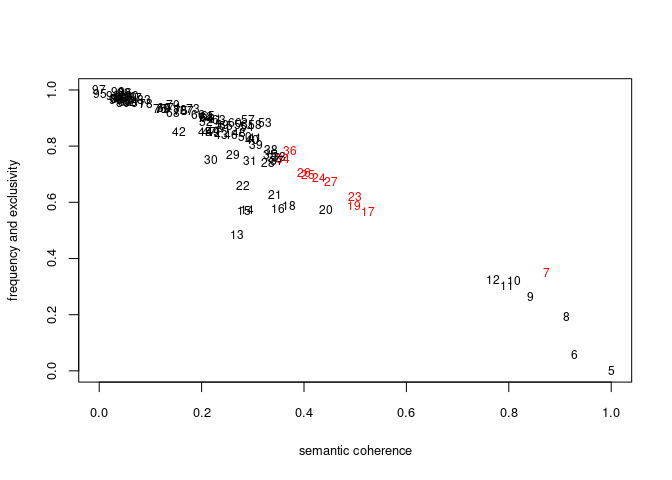

STM/CTM topic modeling - exploratory examples
================
2024-03-03

## Housekeeping

``` r
source("//mnt/Data/git_root/sustainability-reports-industry-analysis/code/modeling.R")
```

    ## 
    ## Attaching package: 'arrow'

    ## The following object is masked from 'package:utils':
    ## 
    ##     timestamp

    ## 
    ## Attaching package: 'dplyr'

    ## The following objects are masked from 'package:stats':
    ## 
    ##     filter, lag

    ## The following objects are masked from 'package:base':
    ## 
    ##     intersect, setdiff, setequal, union

    ## stm v1.3.7 successfully loaded. See ?stm for help. 
    ##  Papers, resources, and other materials at structuraltopicmodel.com

    ## 
    ## Attaching package: 'data.table'

    ## The following objects are masked from 'package:dplyr':
    ## 
    ##     between, first, last

## Initialize class

``` r
exploration = stm_exploration$new(
  input_data_path = "/mnt/Data/git_root/sustainability-reports-industry-analysis/data/processed.parquet",
  sweep_data_dir = "/mnt/Data/git_root/sustainability-reports-industry-analysis/data/model_files",
  export_data_dir = "/mnt/Data/git_root/sustainability-reports-industry-analysis/data/export_files",
  sweep_range = 5:100,
  seed = 42)
```

## Load and preprocess data

``` r
exploration$load_data()
exploration$filter_data()
exploration$preprocess_data()
```

    ## Building corpus... 
    ## Creating Output...

After filtering and preprocessing, documents are considered for
downstream analysis.

## Parameter sweep

``` r
#exploration$parameter_sweep()
exploration$reconstruct_sweep_data()
exploration$plot_sweep()
```

<!-- -->

## Export artifacts

``` r
#exploration$export_artifacts()
```

## Analytical example
